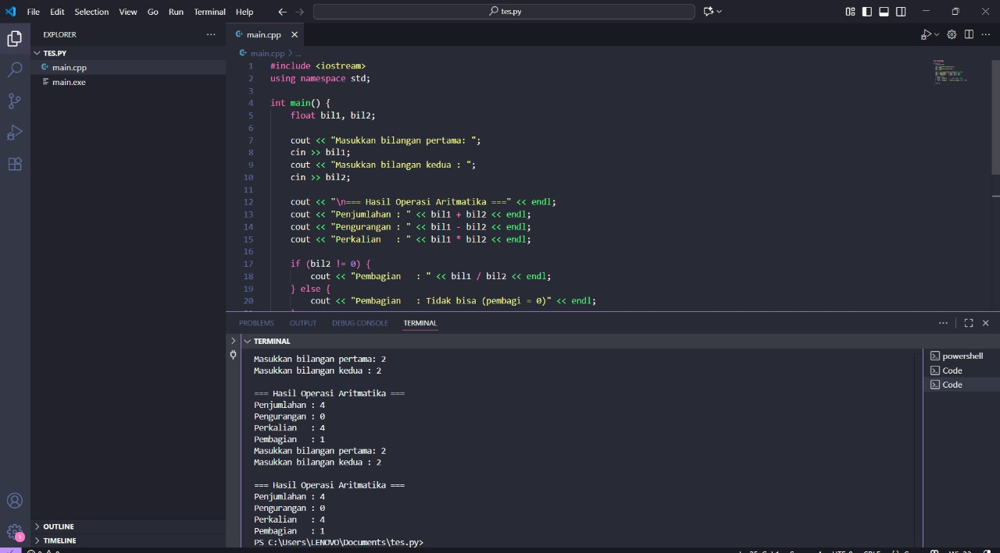

# <h1 align="center">Laporan Praktikum Modul X <br> Nama Modul</h1>
<p align="center">NAMA - NIM</p>

## Dasar Teori

yang panjang dikit

## Unguided

### soal 1

aku mengerjakan perulangan

## Unguided

### Soal 1

copy paste soal nomor 1 disini

```go
#include <iostream>
using namespace std;

int main() {
    float bil1, bil2;

    cout << "Masukkan bilangan pertama: ";
    cin >> bil1;
    cout << "Masukkan bilangan kedua : ";
    cin >> bil2;

    cout << "\n=== Hasil Operasi Aritmatika ===" << endl;
    cout << "Penjumlahan : " << bil1 + bil2 << endl;
    cout << "Pengurangan : " << bil1 - bil2 << endl;
    cout << "Perkalian   : " << bil1 * bil2 << endl;

    if (bil2 != 0) {
        cout << "Pembagian   : " << bil1 / bil2 << endl;
    } else {
        cout << "Pembagian   : Tidak bisa (pembagi = 0)" << endl;
    }

    return 0;
}

```

> Output
> 
> %% Untuk mencantumkan screenshot, tidak boleh ada spasi di urlnya `()`, penamaan file bebas asal gak sara dan mudah dipahami aja,, dan jangan lupa hapus komen ini yah%%

Penjelasan ttg kode kalian disini

### Soal 2

soal nomor 2A

```go
package main

func main() {
	fmt.Println("kode untuk soal nomor 2A")
}
```

> Output
> 

penjelasan kode

Kalau adalanjutan di lanjut disini aja

soal nomor 2B

```go
package main

func main() {
	fmt.Println("kode untuk soal nomor 2B")
}
```

> Output
> 

penjelasan bedanya sesuai soal

## Referensi

1. https://en.wikipedia.org/wiki/Data_structure (diakses blablabla)

