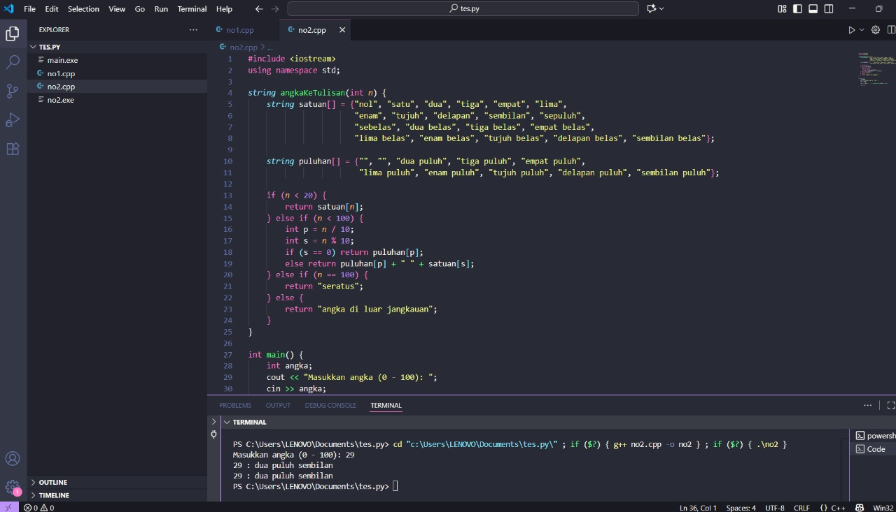
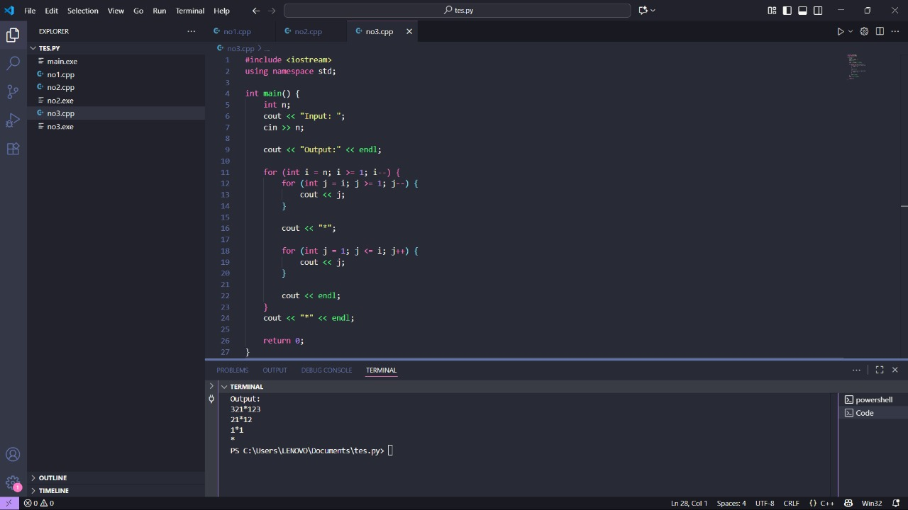

# <h1 align="center">Laporan Praktikum Modul 1 <br> Pengenalan c++ </h1>
<p align="center"> RADITHIA ERLANGGA - 103112400096 </p>

## Dasar Teori
C++ adalah bahasa pemrograman turunan dari C yang cepat, efisien, dan mendukung OOP. Struktur dasarnya terdiri dari library, fungsi main(), serta perintah. Ia menyediakan tipe data, input-output dengan cin dan cout, logika melalui if-else dan perulangan, serta fungsi dan class untuk membuat kode lebih rapi dan kompleks. Dengan dasar ini, C++ dapat digunakan untuk program sederhana hingga aplikasi besar.

## Guided

### soal 1
```go
#include <iostream>
#include <string>
using namespace std;

// Definisi struct
struct Mahasiswa {
    string nama;
    string nim;
    float ipk;
};

int main() {

    Mahasiswa mhs1;

    cout << "Masukkan Nama Mahasiswa: ";
    getline(cin, mhs1.nama);
    // cin >> mhs1.nama;
    cout << "Masukkan NIM Mahasiswa : ";
    cin >> mhs1.nim;
    cout << "Masukkan IPK Mahasiswa : ";
    cin >> mhs1.ipk;

    cout << "\n=== Data Mahasiswa ===" << endl;
    cout << "Nama : " << mhs1.nama << endl;
    cout << "NIM  : " << mhs1.nim << endl;
    cout << "IPK  : " << mhs1.ipk << endl;

    return 0;
}
```

### soal 2
```go
#include <iostream>
using namespace std;
int main()
{
    int W, X, Y;
    float Z;
    X = 7;
    Y = 3;
    W = 1;
    Z = (X + Y) / (Y + W);
    cout << "Nilai z = " << Z << endl;
    return 0;
}
```

### soal 3
```go
#include <iostream>
using namespace std;

int main()
{
    int kode_hari;
    cout << "Menentukan hari kerja/libur\n"<<endl;
    cout << "1=Senin 3=Rabu 5=Jumat 7=Minggu "<<endl;
    cout << "2=Selasa 4=Kamis 6=Sabtu "<<endl;
    cin >> kode_hari;
    switch (kode_hari)
    {
    case 1:
    case 2:
    case 3:
    case 4:
    case 5:
        cout<<"Hari Kerja";
        break;
    case 6:
    case 7:
        cout<<"Hari Libur";
        break;
    default:
        cout<<"Kode masukan salah!!!";
    }
    return 0;
}
```

### soal 4
```go
#include <iostream>
using namespace std;

int main()
{
    int i = 1;
    int jum;
    cin >> jum;
    do
    {
        cout << "bahlil ke-" << (i + 1) << endl;
        i++;
    } while (i < jum);
    return 0;
}
```

### soal 5
```go
#include <iostream>
using namespace std;

// Prosedur: hanya menampilkan hasil, tidak mengembalikan nilai
void tampilkanHasil(double p, double l)
{
    cout << "\n=== Hasil Perhitungan ===" << endl;
    cout << "Panjang : " << p << endl;
    cout << "Lebar   : " << l << endl;
    cout << "Luas    : " << p * l << endl;
    cout << "Keliling: " << 2 * (p + l) << endl;
}

// Fungsi: mengembalikan nilai luas
double hitungLuas(double p, double l)
{
    return p * l;
}

// Fungsi: mengembalikan nilai keliling
double hitungKeliling(double p, double l)
{
    return 2 * (p + l);
}

int main()
{
    double panjang, lebar;

    cout << "Masukkan panjang: ";
    cin >> panjang;
    cout << "Masukkan lebar  : ";
    cin >> lebar;

    // Panggil fungsi
    double luas = hitungLuas(panjang, lebar);
    double keliling = hitungKeliling(panjang, lebar);

    cout << "\nDihitung dengan fungsi:" << endl;
    cout << "Luas      = " << luas << endl;
    cout << "Keliling  = " << keliling << endl;

    // Panggil prosedur
    tampilkanHasil(panjang, lebar);

    return 0;
}

```

### soal 6
```go
#include <iostream>
using namespace std;
int main()
{
    string ch;
    cout << "Masukkan sebuah karakter: ";
    // cin >> ch;
    ch = getchar();  //Menggunakan getchar() untuk membaca satu karakter
    cout << "Karakter yang Anda masukkan adalah: " << ch << endl;
    return 0;
}
```

### Soal 1
Buatlah program yang menerima input-an dua buah bilangan betipe float, kemudian memberikan output-an hasil penjumlahan, pengurangan, perkalian, dan pembagian dari dua bilangan tersebut
```go
#include <iostream>
using namespace std;

int main() {
    float bil1, bil2;

    cout << "Masukkan bilangan pertama: ";
    cin >> bil1;
    cout << "Masukkan bilangan kedua : ";
    cin >> bil2;

    cout << "\n=== Hasil Operasi Aritmatika ===" << endl;
    cout << "Penjumlahan : " << bil1 + bil2 << endl;
    cout << "Pengurangan : " << bil1 - bil2 << endl;
    cout << "Perkalian   : " << bil1 * bil2 << endl;

    if (bil2 != 0) {
        cout << "Pembagian   : " << bil1 / bil2 << endl;
    } else {
        cout << "Pembagian   : Tidak bisa (pembagi = 0)" << endl;
    }

    return 0;
}

```

> Output
> 
Program ini dibuat untuk menerima input dua bilangan float, kemudian menghitung penjumlahan, pengurangan, perkalian, dan pembagiannya. Selain itu, ditambahkan pengecekan agar pembagian tidak dilakukan jika bilangan kedua bernilai nol

### Soal 2
Buatlah sebuah program yang menerima masukan angka dan mengeluarkan output nilai angka tersebut dalam bentuk tulisan. Angka yang akan di-input-kan user adalah bilangan bulat positif mulai dari 0 s.d 100
```go
#include <iostream>
using namespace std;

string angkaKeTulisan(int n) {
    string satuan[] = {"nol", "satu", "dua", "tiga", "empat", "lima",
                       "enam", "tujuh", "delapan", "sembilan", "sepuluh",
                       "sebelas", "dua belas", "tiga belas", "empat belas",
                       "lima belas", "enam belas", "tujuh belas", "delapan belas", "sembilan belas"};
                       
    string puluhan[] = {"", "", "dua puluh", "tiga puluh", "empat puluh",
                        "lima puluh", "enam puluh", "tujuh puluh", "delapan puluh", "sembilan puluh"};

    if (n < 20) {
        return satuan[n];
    } else if (n < 100) {
        int p = n / 10;
        int s = n % 10;
        if (s == 0) return puluhan[p];
        else return puluhan[p] + " " + satuan[s];
    } else if (n == 100) {
        return "seratus";
    } else {
        return "angka di luar jangkauan";
    }
}

int main() {
    int angka;
    cout << "Masukkan angka (0 - 100): ";
    cin >> angka;

    cout << angka << " : " << angkaKeTulisan(angka) << endl;

    return 0;
}

```
> Output
> 
Buat array kata angka → ada satuan (0–19) dan puluhan (20, 30, dst.). Tujuannya biar gampang ngambil kata sesuai angka.
Cek kondisi angka:
Kalau < 20 langsung ambil dari array satuan.
Kalau 20–99, ambil kata dari puluhan terus ditambah kata dari satuan kalau ada sisa satuannya.
Kalau 100, langsung tulis "seratus".
Main function → minta input dari user, terus panggil fungsi angkaKeTulisan() buat ubah angka ke tulisan.
Output → tampilkan angka asli dan tulisannya (contoh: 79 : tujuh puluh sembilan).

### Soal 3
Buatlah program yang dapat memberikan input dan output sbb.
```go
#include <iostream>
using namespace std;

int main() {
    int n;
    cout << "Input: ";
    cin >> n;

    cout << "Output:" << endl;

    for (int i = n; i >= 1; i--) {
        for (int j = i; j >= 1; j--) {
            cout << j;
        }

        cout << "*";

        for (int j = 1; j <= i; j++) {
            cout << j;
        }

        cout << endl;
    }
    cout << "*" << endl;

    return 0;
}

```

> Output
> 
Program ini menggunakan perulangan bersarang untuk mencetak pola angka. Bagian kiri angka dicetak menurun, kemudian ditambahkan tanda *, dan bagian kanan dicetak menaik. Setelah semua baris selesai, ditambahkan satu baris terakhir yang hanya berisi tanda *.


## Referensi

1. https://en.wikipedia.org/wiki/Data_structure (diakses blablabla)

