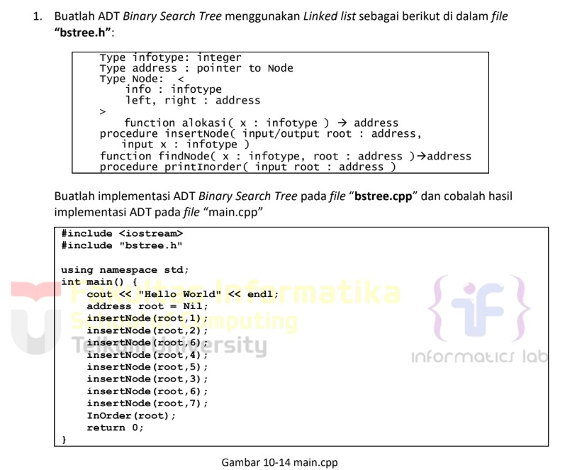
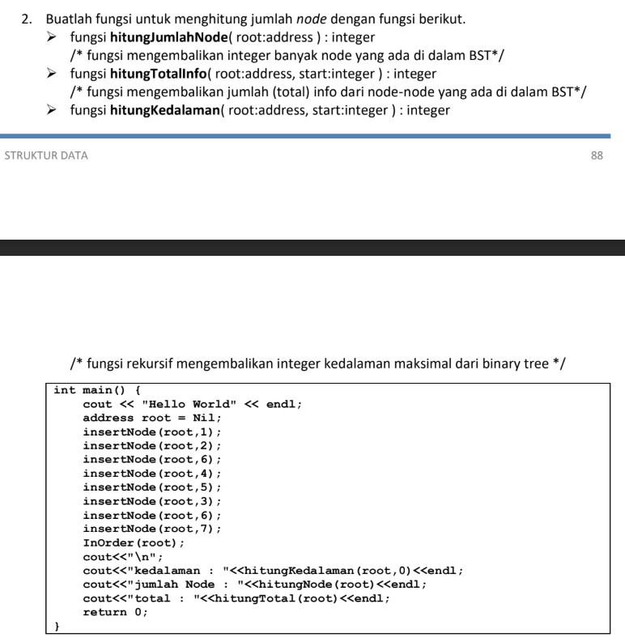
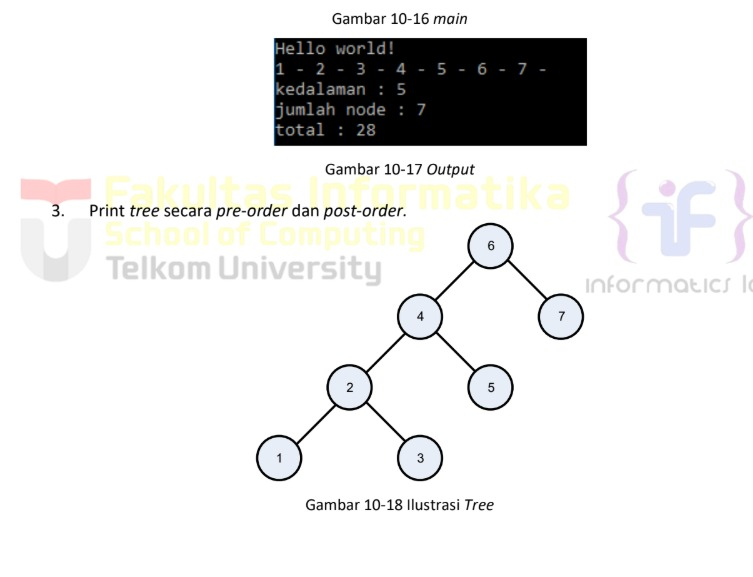

# <h1 align="center">Laporan Praktikum Modul 10 TREE</h1>
<p align="center">Radithia Erlangga - 103112400096</p>

## Dasar Teori
Rekursif adalah konsep di mana sebuah fungsi atau definisi memanggil dirinya sendiri untuk menyelesaikan masalah yang lebih kecil dari masalah asli. Rekursi sering digunakan untuk menangani struktur data yang bersifat hierarkis atau memiliki pola berulang, seperti tree atau linked list. Dengan rekursi, masalah yang kompleks dapat dipecah menjadi submasalah yang lebih sederhana hingga mencapai base case, yaitu kondisi di mana pemanggilan diri dihentikan. Konsep ini memudahkan penulisan algoritma, terutama untuk traversal tree, pencarian, atau operasi-operasi lain yang mengikuti pola berulang.
## Guide
```
#include <iostream>
using namespace std;

struct Node
{
    int data;
    Node *kiri, *kanan;
};

Node *buatNode(int nilai)
{
    Node *baru = new Node();
    baru->data = nilai;
    baru->kiri = baru->kanan = NULL;
    return baru;
}

Node *insert(Node *root, int nilai)
{
    if (root == NULL)
        return buatNode(nilai);
    
    if (nilai < root->data)
        root->kiri = insert(root->kiri, nilai);
    else if (nilai > root->data)
        root->kanan = insert(root->kanan, nilai);

    return root;
}

Node *search(Node *root, int nilai)
{
    if (root == NULL || root->data == nilai)
        return root;

    if (nilai < root->data)
        return search(root->kiri, nilai);

    return search(root->kanan, nilai);
}

Node *nilaiTerkecil(Node *node)
{
    Node *current = node;
    while (current && current->kiri != NULL)
        current = current->kiri;

        return current;
}

Node *hapus(Node *root, int nilai)
{
    if (root == NULL)
        return root;

    if (nilai < root->data)
        root->kiri = hapus(root->kiri, nilai);
    else if (nilai > root->data)
        root->kanan = hapus(root->kanan, nilai);
    else
    {
        if (root->kiri == NULL)
        {
            Node *temp = root->kanan;
            delete root;
            return temp;
        }
        else if (root->kanan == NULL){
            Node *temp = root->kiri;
            delete root;
            return temp;
        }
        Node *temp = nilaiTerkecil(root->kanan);
        root->data = temp->data;
        root->kanan = hapus(root->kanan, temp->data);
    }
    return root;
}

Node *update(Node *root, int Lama, int baru)
{
    if (search(root, Lama) != NULL)
    {
        root = hapus(root, Lama);
        root = insert(root, baru);
        cout << "Data " << Lama << " diupdate menjadi " << baru << endl;
    }
    else
    {
        cout << "Data " << Lama << " tidak ditemukan!" << endl;
    }
    return root;
}

void preOrder(Node *root)
{
    if (root != NULL)
    {
        cout << root->data << " ";
        preOrder(root->kiri);
        preOrder(root->kanan);
    }
}

void inOrder(Node *root)
{
    if (root != NULL)
    {
        inOrder(root->kiri);
        cout << root->data << " ";
        inOrder(root->kanan);
    }
}

void postOrder(Node *root)
{
    if (root != NULL)
    {
        postOrder(root->kiri);
        postOrder(root->kanan);
        cout << root->data << " ";
    }
}

int main()
{
    Node *root = NULL;

    cout << "=== 1. INSERT DATA ===" << endl;
    root = insert(root, 10);
    insert(root, 5);
    insert(root, 20);
    insert(root, 3);
    insert(root, 7);
    insert(root, 15);
    insert(root, 25);
    cout << "Data berhasil dimasukan.\n" << endl;

    cout << "=== 2. TAMPILKAN TREE (TRAVELSAL) ===" << endl;
    cout << "PreOrder : ";
    preOrder(root);
    cout << endl;
    cout << "InOrder : ";
    inOrder(root);
    cout << endl;
    cout << "PostOrder : ";
    postOrder(root);
    cout << "\n" << endl;

    cout << "=== 3. TEST SEARCH ===" << endl;
    int cari1 = 7, cari2 = 99;
    cout << "Cari " << cari1 << ": " << (search(root,cari1) ? "Ketemu" : "Tidak Aada") << endl;
    cout << "Cari " << cari2 << ": " << (search(root,cari2) ? "Ketemu" : "Tidak Aada") << endl;
    cout << endl;

    cout << "=== 4. TEST UPDATE ===" << endl;
    root = update(root, 5, 8);
    cout << "Hasil Order setelah update: ";
    cout << endl;
    cout << endl;

    cout << "PreOrder : ";
    preOrder(root);
    cout << endl;
    cout << "InOrder : ";
    inOrder(root);
    cout << endl;
    cout << "PostOrder : ";
    postOrder(root);
    cout << "\n" << endl;

    cout << "== 5. TEST DELETE ===" << endl;
    cout << "Menghapus angka 20..." << endl;
    root = hapus(root, 20);

    cout << "PreOrder : ";
    preOrder(root);
    cout << endl;
    cout << "InOrder : ";
    inOrder(root);
    cout << endl;
    cout << "PostOrder : ";
    postOrder(root);
    cout << "\n" << endl;

    return 0;
}

```

## Unguide

### Soal 1
>  
## bstree.h
```go
#ifndef BSTREE_H
#define BSTREE_H

typedef int infotype;

struct Node {
    infotype info;
    Node* left;
    Node* right;
};

typedef Node* address;

address alokasi(infotype x);
void insertNode(address &root, infotype x);
address findNode(infotype x, address root);
void printInOrder(address root);

#endif
```
## bstree.cpp
```go
#include "bstree.h"
#include <iostream>
using namespace std;

// fungsi alokasi
address alokasi(infotype x) {
    address p = new Node;
    p->info = x;
    p->left = NULL;
    p->right = NULL;
    return p;
}

// prosedur insertNode (BST)
void insertNode(address &root, infotype x) {
    if (root == NULL) {
        root = alokasi(x);
    } else {
        if (x < root->info) {
            insertNode(root->left, x);
        } else if (x > root->info) {
            insertNode(root->right, x);
        }
    }
}

// function findNode
address findNode(infotype x, address root) {
    if (root == NULL) return NULL;
    else if (x == root->info) return root;
    else if (x < root->info) return findNode(x, root->left);
    else return findNode(x, root->right);
}

// prosedur printInOrder
void printInOrder(address root) {
    if (root != NULL) {
        printInOrder(root->left);
        cout << root->info << " ";
        printInOrder(root->right);
    }
}
```
## main.cpp
```go
#include <iostream>
#include "bstree.h"

using namespace std;

int main() {
    cout << "Hello World!" << endl;

    address root = NULL;

    insertNode(root, 1);
    insertNode(root, 2);
    insertNode(root, 6);
    insertNode(root, 4);
    insertNode(root, 5);
    insertNode(root, 3);
    insertNode(root, 7);

    printInOrder(root);

    return 0;
}
```

> Output
> 
Program di atas membuat Binary Search Tree (BST).
Setiap angka dimasukkan ke tree:
kalau lebih kecil masuk ke kiri,
kalau lebih besar masuk ke kanan.
Setelah semua angka dimasukkan, program mencetak tree dengan cara in-order, sehingga hasilnya muncul urut:
1 2 3 4 5 6 7
Itu saja inti kerjanya.
### Soal 2
> 

## queue.h
```go
#ifndef QUEUE_H
#define QUEUE_H

const int MAX = 5;

typedef int infotype;

struct Queue {
    infotype info[MAX];
    int head;
    int tail;
};

void createQueue(Queue &Q);
bool isEmptyQueue(Queue Q);
bool isFullQueue(Queue Q);
void enqueue(Queue &Q, infotype x);
infotype dequeue(Queue &Q);
void printInfo(Queue Q);

#endif
```

## queue.cpp
```go
#include <iostream>
#include "queue.h"
using namespace std;

void createQueue(Queue &Q) {
    Q.head = -1;
    Q.tail = -1;
}

bool isEmptyQueue(Queue Q) {
    return (Q.head == -1 && Q.tail == -1);
}

bool isFullQueue(Queue Q) {
    return (Q.tail == MAX - 1);
}

void enqueue(Queue &Q, infotype x) {
    if (isFullQueue(Q)) {
        cout << "Queue penuh!" << endl;
        return;
    }
    
    if (isEmptyQueue(Q)) {
        Q.head = 0;
        Q.tail = 0;
    } else {
        Q.tail++;
    }
    Q.info[Q.tail] = x;
}

infotype dequeue(Queue &Q) {
    infotype x;
    if (isEmptyQueue(Q)) {
        cout << "Queue kosong!" << endl;
        return -1;
    }
    
    x = Q.info[Q.head];
    
    if (Q.head == Q.tail) {
        // Queue menjadi kosong (hanya 1 elemen)
        Q.head = -1;
        Q.tail = -1;
    } else {
        // Head bergerak maju
        Q.head++;
    }
    return x;
}

void printInfo(Queue Q) {
    if (isEmptyQueue(Q)) {
        cout << Q.head << " - " << Q.tail << " | empty queue" << endl;
    } else {
        cout << Q.head << " - " << Q.tail << " | ";
        for (int i = Q.head; i <= Q.tail; i++) {
            cout << Q.info[i];
            if (i < Q.tail) cout << " ";
        }
        cout << endl;
    }
}

int main() {
    cout << "Hello World" << endl;
    Queue Q;
    createQueue(Q);
    cout << "---" << endl;
    cout << " H - T \t | Queue info" << endl;
    cout << "---" << endl;
    printInfo(Q);
    enqueue(Q, 5); printInfo(Q);
    enqueue(Q, 2); printInfo(Q);
    enqueue(Q, 7); printInfo(Q);
    dequeue(Q); printInfo(Q);
    enqueue(Q, 4); printInfo(Q);
    dequeue(Q); printInfo(Q);
    dequeue(Q); printInfo(Q);
    dequeue(Q); printInfo(Q);
    return 0;
}

```

> Output
> 
Penjelasan Karakteristik Alternatif 2: Head bergerak maju saat dequeue,Tail bergerak maju saat enqueue,Tidak ada penggeseran elemen seperti pada Alternatif 1,Lebih efisien karena operasi dequeue hanya O(1),Masalah: terjadi "wasted space" di depan array setelah dequeue
### Soal 3
> 
## queue.h
```go
#ifndef QUEUE_H
#define QUEUE_H

const int MAX = 5;

typedef int infotype;

struct Queue {
    infotype info[MAX];
    int head;
    int tail;
};

void createQueue(Queue &Q);
bool isEmptyQueue(Queue Q);
bool isFullQueue(Queue Q);
void enqueue(Queue &Q, infotype x);
infotype dequeue(Queue &Q);
void printInfo(Queue Q);

#endif
```

## queue.cpp
```go
#include <iostream>
#include "queue.h"
using namespace std;

void createQueue(Queue &Q) {
    Q.head = -1;
    Q.tail = -1;
}

bool isEmptyQueue(Queue Q) {
    return (Q.head == -1 && Q.tail == -1);
}

bool isFullQueue(Queue Q) {
    return ((Q.tail + 1) % MAX == Q.head);
}

void enqueue(Queue &Q, infotype x) {
    if (isFullQueue(Q)) {
        cout << "Queue penuh!" << endl;
        return;
    }
    
    if (isEmptyQueue(Q)) {
        Q.head = 0;
        Q.tail = 0;
    } else {
        Q.tail = (Q.tail + 1) % MAX;
    }
    Q.info[Q.tail] = x;
}

infotype dequeue(Queue &Q) {
    infotype x;
    if (isEmptyQueue(Q)) {
        cout << "Queue kosong!" << endl;
        return -1;
    }
    
    x = Q.info[Q.head];
    
    if (Q.head == Q.tail) {
        // Queue menjadi kosong (hanya 1 elemen)
        Q.head = -1;
        Q.tail = -1;
    } else {
        // Head berputar maju
        Q.head = (Q.head + 1) % MAX;
    }
    return x;
}

void printInfo(Queue Q) {
    if (isEmptyQueue(Q)) {
        cout << Q.head << " - " << Q.tail << " | empty queue" << endl;
    } else {
        cout << Q.head << " - " << Q.tail << " | ";
        
        if (Q.head <= Q.tail) {
            // Normal case: head di kiri, tail di kanan
            for (int i = Q.head; i <= Q.tail; i++) {
                cout << Q.info[i];
                if (i < Q.tail) cout << " ";
            }
        } else {
            // Wrap-around case: head di kanan, tail di kiri
            for (int i = Q.head; i < MAX; i++) {
                cout << Q.info[i] << " ";
            }
            for (int i = 0; i <= Q.tail; i++) {
                cout << Q.info[i];
                if (i < Q.tail) cout << " ";
            }
        }
        cout << endl;
    }
}

int main() {
    cout << "Hello World" << endl;
    Queue Q;
    createQueue(Q);
    cout << "---" << endl;
    cout << " H - T \t | Queue info" << endl;
    cout << "---" << endl;
    printInfo(Q);
    enqueue(Q, 5); printInfo(Q);
    enqueue(Q, 2); printInfo(Q);
    enqueue(Q, 7); printInfo(Q);
    dequeue(Q); printInfo(Q);
    enqueue(Q, 4); printInfo(Q);
    dequeue(Q); printInfo(Q);
    dequeue(Q); printInfo(Q);
    dequeue(Q); printInfo(Q);
    
    // Demonstrasi circular behavior
    cout << "\n--- Demonstrasi Circular Behavior ---" << endl;
    createQueue(Q);
    enqueue(Q, 1); printInfo(Q);
    enqueue(Q, 2); printInfo(Q);
    enqueue(Q, 3); printInfo(Q);
    enqueue(Q, 4); printInfo(Q);
    dequeue(Q); printInfo(Q);  // Keluarkan 1
    dequeue(Q); printInfo(Q);  // Keluarkan 2
    enqueue(Q, 5); printInfo(Q);  // Masuk di posisi 0
    enqueue(Q, 6); printInfo(Q);  // Masuk di posisi 1 (tail wrap-around)
    
    return 0;
}
```
> Output
> 
Penjelasan Karakteristik Alternatif 3 (Circular Queue):,Head dan tail berputar menggunakan operasi modulo (% MAX),Memanfaatkan semua space dalam array,Tidak ada wasted space seperti pada Alternatif 2


## Referensi
1.https://www.geeksforgeeks.org/queue-data-structure/
2.https://www.programiz.com/dsa/queue
3.https://www.javatpoint.com/ds-queue
4.https://www.w3schools.com/dsa/dsa_data_queues.php
5.https://leetcode.com/tag/queue/


