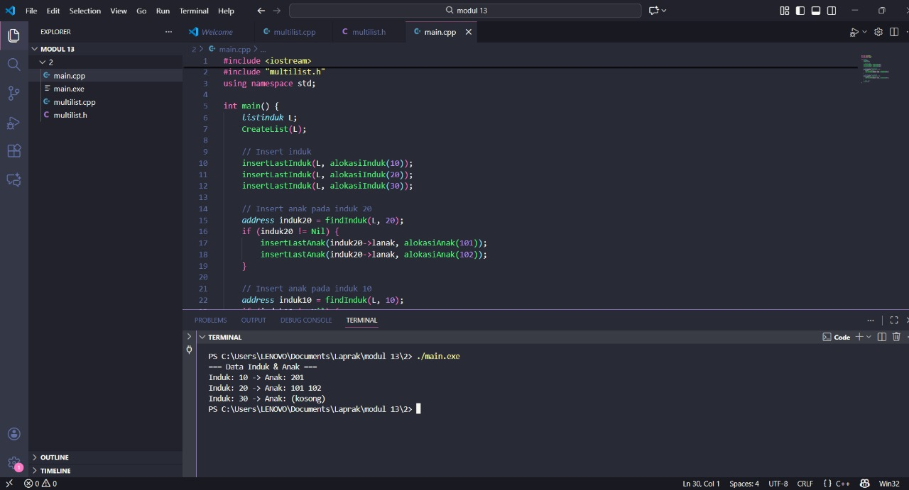

# <h1 align="center">Laporan Praktikum Modul 13 Multi Linked List</h1>
<p align="center">Radithia Erlangga - 103112400096</p>

## Dasar Teori
Multi linked list adalah struktur data yang menggunakan lebih dari satu pointer pada setiap node sehingga satu node dapat terhubung ke beberapa arah atau level sekaligus. Berbeda dengan single linked list yang hanya memiliki pointer berikutnya (next), pada multi linked list biasanya terdapat pointer tambahan seperti next, down, atau child sehingga data dapat direpresentasikan dalam bentuk hierarki atau kategori bertingkat. Struktur ini cocok digunakan ketika data memiliki hubungan bercabang, seperti daftar fakultas → jurusan → kelas → mahasiswa, sehingga memudahkan organisasi dan traversing data yang tidak bersifat linear saja.
## Guide
```
#include <iostream>
#include <string>
using namespace std;

struct ChildNode
{
    string info;
    ChildNode *next;
};

struct ParentNode
{
    string info;
    ChildNode *childHead;
    ParentNode *next;
};

ParentNode *createParent(string info)
{
    ParentNode *newNode = new ParentNode;
    newNode->info = info;
    newNode->childHead = NULL;
    newNode->next = NULL;
    return newNode;
}

ChildNode *createChild(string info)
{
    ChildNode *newNode = new ChildNode;
    newNode->info = info;
    newNode->next = NULL;
    return newNode;
}

void insertParent(ParentNode *&head, string info)
{
    ParentNode *newNode = createParent(info);
    if (head == NULL)
    {
        head = newNode;
    }
    else
    {
        ParentNode *temp = head;
        while (temp->next != NULL)
        {
            temp = temp->next;
        }
        temp->next = newNode;
    }
}

void insertChild(ParentNode *head, string parentInfo, string childInfo)
{
    ParentNode *p = head;
    while (p != NULL && p->info != parentInfo)
    {
        p = p->next;
    }

    if (p != NULL)
    {
        ChildNode *newChild = createChild(childInfo);
        if (p->childHead == NULL)
        {
            p->childHead = newChild;
        }
        else 
        {
            ChildNode *c = p->childHead;
            while (c->next != NULL)
            {
                c = c->next;
            }
            c->next = newChild;
        }
    }
}

void printAll(ParentNode *head)
{
    ParentNode *p = head;
    while (p != NULL)
    {
        cout << p->info;
        ChildNode *c = p->childHead;
        if (c != NULL)
        {
            while (c != NULL)
            {
                cout << " -> " << c->info;
                c = c->next;
            }
        }
        cout << endl;
        p = p->next;
    }
}

int main()
{
    ParentNode *list = NULL;

    insertParent(list, "Parent Node 1");
    insertParent(list, "Parent Node 2");

    insertChild(list, "Parent Node 1", "Child Node A");
    insertChild(list, "Parent Node 1", "Child Node B");
    insertChild(list, "Parent Node 2", "Child Node C");

    printAll(list);

    return 0;
}
```

## Unguide

### Soal 2
 Buatkan multilist.cpp untuk implementasi semua fungsi pada multilist.h. Buat main.cpp untuk pemanggilan fungsi-fungsi tersebut.
## multilist.h
```go
#ifndef MULTILIST_H_INCLUDED
#define MULTILIST_H_INCLUDED
#include <iostream>
using namespace std;

#define Nil NULL

typedef int infotypeanak;
typedef int infotypeinduk;

struct elemen_list_anak;
struct elemen_list_induk;

typedef elemen_list_induk *address;
typedef elemen_list_anak *address_anak;

struct elemen_list_anak {
    infotypeanak info;
    address_anak next;
    address_anak prev;
};

struct listanak {
    address_anak first;
    address_anak last;
};

struct elemen_list_induk {
    infotypeinduk info;
    listanak lanak;
    address next;
    address prev;
};

struct listinduk {
    address first;
    address last;
};

//--- FUNGSI UTAMA ---
void CreateList(listinduk &L);
void CreateListAnak(listanak &L);
address alokasiInduk(infotypeinduk x);
address_anak alokasiAnak(infotypeanak x);
void insertLastInduk(listinduk &L, address P);
void insertLastAnak(listanak &L, address_anak P);
address findInduk(listinduk L, infotypeinduk x);
void printAll(listinduk L);

#endif

```
## multilist.cpp
```go
#include "multilist.h"

void CreateList(listinduk &L) {
    L.first = Nil;
    L.last = Nil;
}

void CreateListAnak(listanak &L) {
    L.first = Nil;
    L.last = Nil;
}

address alokasiInduk(infotypeinduk x) {
    address P = new elemen_list_induk;
    P->info = x;
    CreateListAnak(P->lanak);
    P->next = Nil;
    P->prev = Nil;
    return P;
}

address_anak alokasiAnak(infotypeanak x) {
    address_anak P = new elemen_list_anak;
    P->info = x;
    P->next = Nil;
    P->prev = Nil;
    return P;
}

void insertLastInduk(listinduk &L, address P) {
    if (L.first == Nil) {
        L.first = P;
        L.last = P;
    } else {
        L.last->next = P;
        P->prev = L.last;
        L.last = P;
    }
}

void insertLastAnak(listanak &L, address_anak P) {
    if (L.first == Nil) {
        L.first = P;
        L.last = P;
    } else {
        L.last->next = P;
        P->prev = L.last;
        L.last = P;
    }
}

address findInduk(listinduk L, infotypeinduk x) {
    address P = L.first;
    while (P != Nil) {
        if (P->info == x) return P;
        P = P->next;
    }
    return Nil;
}

void printAll(listinduk L) {
    cout << "=== Data Induk & Anak ===\n";
    address P = L.first;

    while (P != Nil) {
        cout << "Induk: " << P->info << " -> Anak: ";
        address_anak Q = P->lanak.first;

        if (Q == Nil) cout << "(kosong)";
        while (Q != Nil) {
            cout << Q->info << " ";
            Q = Q->next;
        }
        cout << endl;

        P = P->next;
    }
}

```
## main.cpp
```go
#include <iostream>
#include "multilist.h"
using namespace std;

int main() {
    listinduk L;
    CreateList(L);

    // Insert induk
    insertLastInduk(L, alokasiInduk(10));
    insertLastInduk(L, alokasiInduk(20));
    insertLastInduk(L, alokasiInduk(30));

    // Insert anak pada induk 20
    address induk20 = findInduk(L, 20);
    if (induk20 != Nil) {
        insertLastAnak(induk20->lanak, alokasiAnak(101));
        insertLastAnak(induk20->lanak, alokasiAnak(102));
    }

    // Insert anak pada induk 10
    address induk10 = findInduk(L, 10);
    if (induk10 != Nil) {
        insertLastAnak(induk10->lanak, alokasiAnak(201));
    }

    // Print semua
    printAll(L);
}

```

> Output
> 
Program di atas membuat struktur induk–anak, di mana setiap induk punya daftar anak sendiri. Program menambah beberapa induk (10, 20, 30), lalu menambahkan anak ke induk tertentu, misalnya induk 20 mendapat anak 101 dan 102. Semua data dibuat dengan fungsi alokasi, lalu dimasukkan ke list menggunakan insert. Terakhir, program menampilkan seluruh induk beserta anak-anaknya. Intinya, program menunjukkan cara membuat dan menghubungkan list induk dengan list anak menggunakan multi linked list.
### Soal 3
Buatlah ADT Multi Linked list sebagai berikut di dalam file “circularlist.h”:
## circularlist.h
```go
#ifndef CIRCULARLIST_H_INCLUDED
#define CIRCULARLIST_H_INCLUDED

#include <iostream>
using namespace std;

#define Nil NULL

struct infotype {
    string nama;
    string nim;
    char jenis_kelamin;
    float ipk;
};

struct ElmList;
typedef ElmList* address;

struct ElmList {
    infotype info;
    address next;
};

struct List {
    address first;
};

// ==== FUNGSI DAN PROSEDUR ====
void createList(List &L);
address alokasi(infotype x);
void dealokasi(address P);

void insertFirst(List &L, address P);
void insertAfter(List &L, address Prec, address P);
void insertLast(List &L, address P);

void deleteFirst(List &L, address &P);
void deleteAfter(List &L, address Prec, address &P);
void deleteLast(List &L, address &P);

address findElm(List L, infotype x);
void printInfo(List L);

#endif


```
## circularlist.cpp
```go
#include "circularlist.h"

void createList(List &L) {
    L.first = Nil;
}

address alokasi(infotype x) {
    address P = new ElmList;
    P->info = x;
    P->next = Nil;
    return P;
}

void dealokasi(address P) {
    delete P;
}

void insertFirst(List &L, address P) {
    if (L.first == Nil) {
        L.first = P;
        P->next = P; // circular
    } else {
        address last = L.first;
        while (last->next != L.first) {
            last = last->next;
        }
        P->next = L.first;
        last->next = P;
        L.first = P;
    }
}

void insertAfter(List &L, address Prec, address P) {
    if (Prec != Nil) {
        P->next = Prec->next;
        Prec->next = P;
    }
}

void insertLast(List &L, address P) {
    if (L.first == Nil) {
        insertFirst(L, P);
    } else {
        address last = L.first;
        while (last->next != L.first) {
            last = last->next;
        }
        last->next = P;
        P->next = L.first;
    }
}

void deleteFirst(List &L, address &P) {
    if (L.first == Nil) return;

    address last = L.first;
    while (last->next != L.first) {
        last = last->next;
    }

    P = L.first;

    if (last == L.first) { 
        L.first = Nil;
    } else {
        L.first = L.first->next;
        last->next = L.first;
    }
}

void deleteAfter(List &L, address Prec, address &P) {
    if (Prec != Nil && Prec->next != Nil) {
        P = Prec->next;
        Prec->next = P->next;
    }
}

void deleteLast(List &L, address &P) {
    if (L.first == Nil) return;

    address last = L.first;
    address prev = Nil;

    while (last->next != L.first) {
        prev = last;
        last = last->next;
    }

    P = last;

    if (prev == Nil) {
        L.first = Nil;
    } else {
        prev->next = L.first;
    }
}

address findElm(List L, infotype x) {
    address P = L.first;
    if (P == Nil) return Nil;

    do {
        if (P->info.nim == x.nim)
            return P;
        P = P->next;
    } while (P != L.first);

    return Nil;
}

void printInfo(List L) {
    if (L.first == Nil) {
        cout << "List kosong\n";
        return;
    }

    address P = L.first;
    cout << "=== Data Mahasiswa ===\n";

    do {
        cout << P->info.nim << " - " << P->info.nama
             << " (" << P->info.jenis_kelamin << ") | IPK: "
             << P->info.ipk << endl;
        P = P->next;
    } while (P != L.first);
}


```
## main.cpp
```go
#include <iostream>
#include "circularlist.h"
using namespace std;

// Fungsi createData dari modul
address createData(string nama, string nim, char jenis_kelamin, float ipk) {
    infotype x;
    x.nama = nama;
    x.nim = nim;
    x.jenis_kelamin = jenis_kelamin;
    x.ipk = ipk;

    return alokasi(x);
}

int main() {
    List L;
    createList(L);

    cout << "Coba insert first, last, dan after\n";

    address P1, P2;
    infotype x;

    insertFirst(L, createData("Danu", "04", 'L', 4.0));
    insertLast(L, createData("Fahmi", "06", 'L', 3.45));
    insertFirst(L, createData("Bobi", "02", 'L', 3.71));
    insertFirst(L, createData("Ali", "01", 'L', 3.3));
    insertLast(L, createData("Gita", "07", 'P', 3.75));

    // Insert After "07"
    x.nim = "07";
    P1 = findElm(L, x);
    P2 = createData("Cindi", "03", 'P', 3.5);
    insertAfter(L, P1, P2);

    // Insert After "02"
    x.nim = "02";
    P1 = findElm(L, x);
    P2 = createData("Hilmi", "08", 'P', 3.3);
    insertAfter(L, P1, P2);

    // Insert After "04"
    x.nim = "04";
    P1 = findElm(L, x);
    P2 = createData("Eli", "05", 'P', 3.4);
    insertAfter(L, P1, P2);

    printInfo(L);

    return 0;
}


```

> Output
> 
Program circular linked list tersebut menyimpan data mahasiswa dalam bentuk list yang ujungnya kembali ke elemen pertama sehingga membentuk lingkaran. Program membuat list kosong, lalu menambah elemen di awal, akhir, dan setelah elemen tertentu menggunakan fungsi insert. Setiap elemen berisi nama, NIM, jenis kelamin, dan IPK. Fungsi findElm dipakai untuk mencari mahasiswa berdasarkan NIM sebelum melakukan insertAfter. Setelah semua penyisipan selesai, fungsi printInfo menampilkan seluruh data mahasiswa dalam urutan circular list. Secara sederhana, program ini menunjukkan cara menambah dan menampilkan data mahasiswa menggunakan struktur circular linked list.


## Referensi
1.https://www.geeksforgeeks.org/binary-tree-data-structure/
2.https://www.geeksforgeeks.org/binary-search-tree-data-structure/
3.https://www.geeksforgeeks.org/tree-traversals-inorder-preorder-and-postorder/
4.https://www.javatpoint.com/binary-search-tree
5.https://www.w3schools.com/dsa/dsa_data_trees.php


