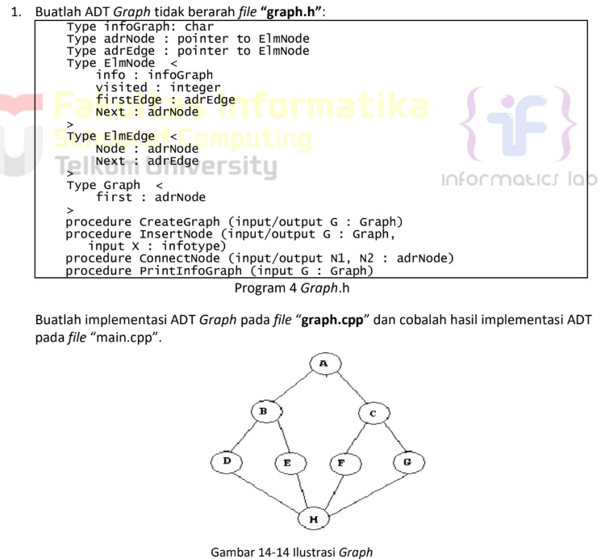
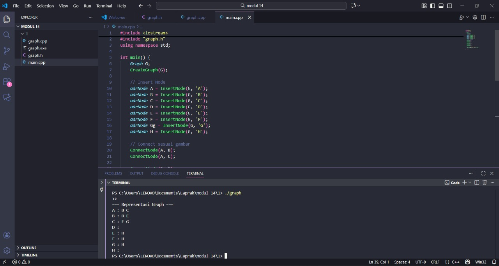
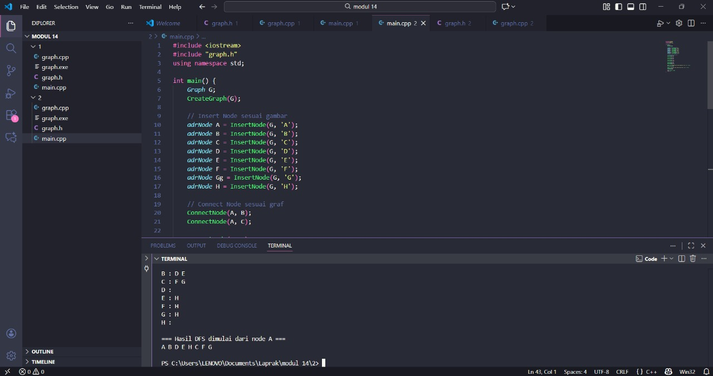
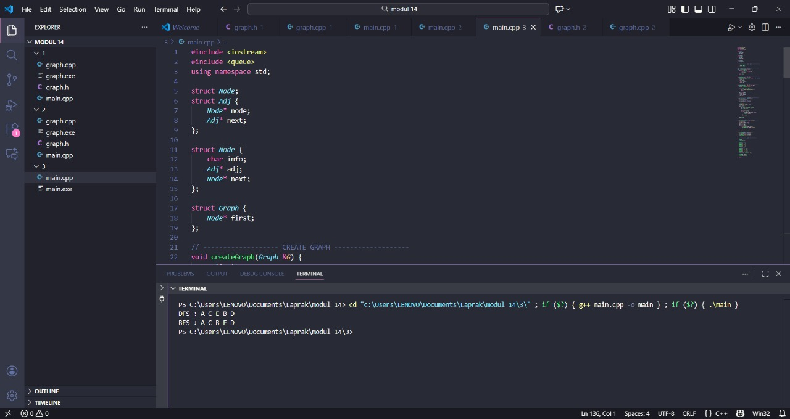

# <h1 align="center">Laporan Praktikum Modul 14 GRAPH</h1>
<p align="center">Radithia Erlangga - 103112400096</p>

## Dasar Teori
Graph merupakan himpunan tidak kosong dari node (vertec) dan garis penghubung (edge). Contoh sederhana tentang graph, yaitu antara Tempat Kost Anda dengan Common Lab. Tempat Kost Anda
dan Common Lab merupakan node (vertec). Jalan yang menghubungkan tempat Kost dan Common Lab merupakan garis penghubung antara keduanya (edge).
## Guide
```
#include <iostream>
using namespace std;

struct Node
{
    int data;
    Node *kiri, *kanan;
};

Node *buatNode(int nilai)
{
    Node *baru = new Node();
    baru->data = nilai;
    baru->kiri = baru->kanan = NULL;
    return baru;
}

Node *insert(Node *root, int nilai)
{
    if (root == NULL)
        return buatNode(nilai);
    
    if (nilai < root->data)
        root->kiri = insert(root->kiri, nilai);
    else if (nilai > root->data)
        root->kanan = insert(root->kanan, nilai);

    return root;
}

Node *search(Node *root, int nilai)
{
    if (root == NULL || root->data == nilai)
        return root;

    if (nilai < root->data)
        return search(root->kiri, nilai);

    return search(root->kanan, nilai);
}

Node *nilaiTerkecil(Node *node)
{
    Node *current = node;
    while (current && current->kiri != NULL)
        current = current->kiri;

        return current;
}

Node *hapus(Node *root, int nilai)
{
    if (root == NULL)
        return root;

    if (nilai < root->data)
        root->kiri = hapus(root->kiri, nilai);
    else if (nilai > root->data)
        root->kanan = hapus(root->kanan, nilai);
    else
    {
        if (root->kiri == NULL)
        {
            Node *temp = root->kanan;
            delete root;
            return temp;
        }
        else if (root->kanan == NULL){
            Node *temp = root->kiri;
            delete root;
            return temp;
        }
        Node *temp = nilaiTerkecil(root->kanan);
        root->data = temp->data;
        root->kanan = hapus(root->kanan, temp->data);
    }
    return root;
}

Node *update(Node *root, int Lama, int baru)
{
    if (search(root, Lama) != NULL)
    {
        root = hapus(root, Lama);
        root = insert(root, baru);
        cout << "Data " << Lama << " diupdate menjadi " << baru << endl;
    }
    else
    {
        cout << "Data " << Lama << " tidak ditemukan!" << endl;
    }
    return root;
}

void preOrder(Node *root)
{
    if (root != NULL)
    {
        cout << root->data << " ";
        preOrder(root->kiri);
        preOrder(root->kanan);
    }
}

void inOrder(Node *root)
{
    if (root != NULL)
    {
        inOrder(root->kiri);
        cout << root->data << " ";
        inOrder(root->kanan);
    }
}

void postOrder(Node *root)
{
    if (root != NULL)
    {
        postOrder(root->kiri);
        postOrder(root->kanan);
        cout << root->data << " ";
    }
}

int main()
{
    Node *root = NULL;

    cout << "=== 1. INSERT DATA ===" << endl;
    root = insert(root, 10);
    insert(root, 5);
    insert(root, 20);
    insert(root, 3);
    insert(root, 7);
    insert(root, 15);
    insert(root, 25);
    cout << "Data berhasil dimasukan.\n" << endl;

    cout << "=== 2. TAMPILKAN TREE (TRAVELSAL) ===" << endl;
    cout << "PreOrder : ";
    preOrder(root);
    cout << endl;
    cout << "InOrder : ";
    inOrder(root);
    cout << endl;
    cout << "PostOrder : ";
    postOrder(root);
    cout << "\n" << endl;

    cout << "=== 3. TEST SEARCH ===" << endl;
    int cari1 = 7, cari2 = 99;
    cout << "Cari " << cari1 << ": " << (search(root,cari1) ? "Ketemu" : "Tidak Aada") << endl;
    cout << "Cari " << cari2 << ": " << (search(root,cari2) ? "Ketemu" : "Tidak Aada") << endl;
    cout << endl;

    cout << "=== 4. TEST UPDATE ===" << endl;
    root = update(root, 5, 8);
    cout << "Hasil Order setelah update: ";
    cout << endl;
    cout << endl;

    cout << "PreOrder : ";
    preOrder(root);
    cout << endl;
    cout << "InOrder : ";
    inOrder(root);
    cout << endl;
    cout << "PostOrder : ";
    postOrder(root);
    cout << "\n" << endl;

    cout << "== 5. TEST DELETE ===" << endl;
    cout << "Menghapus angka 20..." << endl;
    root = hapus(root, 20);

    cout << "PreOrder : ";
    preOrder(root);
    cout << endl;
    cout << "InOrder : ";
    inOrder(root);
    cout << endl;
    cout << "PostOrder : ";
    postOrder(root);
    cout << "\n" << endl;

    return 0;
}

```

## Unguide

### Soal 1
>  
## graph.h
```go
#ifndef GRAPH_H
#define GRAPH_H

typedef char infoGraph;

typedef struct ElmEdge *adrEdge;
typedef struct ElmNode *adrNode;

struct ElmEdge {
    adrNode node;
    adrEdge next;
};

struct ElmNode {
    infoGraph info;
    int visited;
    adrEdge firstEdge;
    adrNode next;
};

struct Graph {
    adrNode first;
};

// Prosedur
void CreateGraph(Graph &G);
adrNode InsertNode(Graph &G, infoGraph X);
void ConnectNode(adrNode N1, adrNode N2);
void PrintInfoGraph(Graph G);

#endif


```
## graph.cpp
```go
#include <iostream>
#include "graph.h"
using namespace std;

void CreateGraph(Graph &G) {
    G.first = NULL;
}

adrNode InsertNode(Graph &G, infoGraph X) {
    adrNode P = new ElmNode;
    P->info = X;
    P->visited = 0;
    P->firstEdge = NULL;
    P->next = NULL;

    if (G.first == NULL) {
        G.first = P;
    } else {
        adrNode Q = G.first;
        while (Q->next != NULL) {
            Q = Q->next;
        }
        Q->next = P;
    }
    return P;
}

void ConnectNode(adrNode N1, adrNode N2) {
    adrEdge E = new ElmEdge;
    E->node = N2;
    E->next = NULL;

    if (N1->firstEdge == NULL) {
        N1->firstEdge = E;
    } else {
        adrEdge T = N1->firstEdge;
        while (T->next != NULL) {
            T = T->next;
        }
        T->next = E;
    }
}

void PrintInfoGraph(Graph G) {
    adrNode N = G.first;
    while (N != NULL) {
        cout << N->info << " : ";
        adrEdge E = N->firstEdge;
        while (E != NULL) {
            cout << E->node->info << " ";
            E = E->next;
        }
        cout << endl;
        N = N->next;
    }
}

```
## main.cpp
```go
#include <iostream>
#include "graph.h"
using namespace std;

int main() {
    Graph G;
    CreateGraph(G);

    // Insert Node
    adrNode A = InsertNode(G, 'A');
    adrNode B = InsertNode(G, 'B');
    adrNode C = InsertNode(G, 'C');
    adrNode D = InsertNode(G, 'D');
    adrNode E = InsertNode(G, 'E');
    adrNode F = InsertNode(G, 'F');
    adrNode Gg = InsertNode(G, 'G');
    adrNode H = InsertNode(G, 'H');

    // Connect sesuai gambar
    ConnectNode(A, B);
    ConnectNode(A, C);

    ConnectNode(B, D);
    ConnectNode(B, E);

    ConnectNode(C, F);
    ConnectNode(C, Gg);

    ConnectNode(E, H);
    ConnectNode(F, H);
    ConnectNode(Gg, H);

    // Print Graph
    cout << "=== Representasi Graph ===" << endl;
    PrintInfoGraph(G);

    return 0;
}

```

> Output
> 
InsertNode → menambahkan simpul (vertex).
ConnectNode → membuat edge (hubungan) dari satu node ke node lain.
PrintInfoGraph → menampilkan adjacency list.
### Soal 2
Buatlah prosedur untuk menampilkanhasil penelusuran DFS. prosedur PrintDFS (Graph G, adrNode N);

## graph.h
```go
#ifndef GRAPH_H
#define GRAPH_H

typedef char infoGraph;

typedef struct ElmEdge *adrEdge;
typedef struct ElmNode *adrNode;

struct ElmEdge {
    adrNode node;
    adrEdge next;
};

struct ElmNode {
    infoGraph info;
    int visited;
    adrEdge firstEdge;
    adrNode next;
};

struct Graph {
    adrNode first;
};

void CreateGraph(Graph &G);
adrNode InsertNode(Graph &G, infoGraph X);
void ConnectNode(adrNode N1, adrNode N2);
void PrintInfoGraph(Graph G);

// nomor 2
void PrintDFS(Graph &G, adrNode N);
void resetVisited(Graph &G);

#endif

```
## graph.cpp
```go
#include <iostream>
#include "graph.h"
using namespace std;

void CreateGraph(Graph &G) {
    G.first = NULL;
}

adrNode InsertNode(Graph &G, infoGraph X) {
    adrNode P = new ElmNode;
    P->info = X;
    P->visited = 0;
    P->firstEdge = NULL;
    P->next = NULL;

    if (G.first == NULL) {
        G.first = P;
    } else {
        adrNode Q = G.first;
        while (Q->next != NULL) {
            Q = Q->next;
        }
        Q->next = P;
    }
    return P;
}

void ConnectNode(adrNode N1, adrNode N2) {
    adrEdge E = new ElmEdge;
    E->node = N2;
    E->next = NULL;

    if (N1->firstEdge == NULL) {
        N1->firstEdge = E;
    } else {
        adrEdge T = N1->firstEdge;
        while (T->next != NULL) {
            T = T->next;
        }
        T->next = E;
    }
}

void PrintInfoGraph(Graph G) {
    adrNode N = G.first;
    while (N != NULL) {
        cout << N->info << " : ";
        adrEdge E = N->firstEdge;
        while (E != NULL) {
            cout << E->node->info << " ";
            E = E->next;
        }
        cout << endl;
        N = N->next;
    }
}

// ---------------------- Nomor 2 (DFS) ---------------------- //

void resetVisited(Graph &G) {
    adrNode P = G.first;
    while (P != NULL) {
        P->visited = 0;
        P = P->next;
    }
}

void PrintDFS(Graph &G, adrNode N) {
    if (N == NULL) return;

    cout << N->info << " ";
    N->visited = 1;

    adrEdge E = N->firstEdge;
    while (E != NULL) {
        if (E->node->visited == 0) {
            PrintDFS(G, E->node);
        }
        E = E->next;
    }
}

```
## main.cpp
```go
#include <iostream>
#include "graph.h"
using namespace std;

int main() {
    Graph G;
    CreateGraph(G);

    // Insert Node sesuai gambar
    adrNode A = InsertNode(G, 'A');
    adrNode B = InsertNode(G, 'B');
    adrNode C = InsertNode(G, 'C');
    adrNode D = InsertNode(G, 'D');
    adrNode E = InsertNode(G, 'E');
    adrNode F = InsertNode(G, 'F');
    adrNode Gg = InsertNode(G, 'G');
    adrNode H = InsertNode(G, 'H');

    // Connect Node sesuai graf
    ConnectNode(A, B);
    ConnectNode(A, C);

    ConnectNode(B, D);
    ConnectNode(B, E);

    ConnectNode(C, F);
    ConnectNode(C, Gg);

    ConnectNode(E, H);
    ConnectNode(F, H);
    ConnectNode(Gg, H);

    cout << "=== Representasi Graph (Adjacency List) ===" << endl;
    PrintInfoGraph(G);

    cout << "\n=== Hasil DFS dimulai dari node A ===" << endl;
    resetVisited(G);
    PrintDFS(G, A);

    cout << endl << endl;
    return 0;
}


```

> Output
> 
PrintDFS adalah prosedur penelusuran graf yang dilakukan secara mendalam, yaitu mulai dari simpul awal lalu langsung masuk ke simpul berikutnya terus menerus sampai tidak ada jalur lagi. Setiap simpul yang dikunjungi diberi tanda agar tidak dikunjungi dua kali, kemudian proses dilanjutkan secara rekursif ke tetangga yang belum dikunjungi. Dengan cara ini, DFS menelusuri graf seperti menelusuri jalan sampai ke ujung dulu, baru kembali dan melanjutkan ke jalur lainnya.
### Soal 3
Buatlah prosedur untuk menampilkanhasil penelusuran DFS. prosedur PrintBFS (Graph G, adrNode N);
## main.cpp
```go
#include <iostream>
#include <queue>
using namespace std;

struct Node;
struct Adj {
    Node* node;
    Adj* next;
};

struct Node {
    char info;
    Adj* adj;
    Node* next;
};

struct Graph {
    Node* first;
};

// ------------------- CREATE GRAPH -------------------
void createGraph(Graph &G) {
    G.first = NULL;
}

// ------------------- FIND NODE -------------------
Node* findNode(Graph G, char x) {
    Node* p = G.first;
    while (p != NULL) {
        if (p->info == x) return p;
        p = p->next;
    }
    return NULL;
}

// ------------------- ADD NODE -------------------
void addNode(Graph &G, char x) {
    if(findNode(G, x) != NULL) return; // node sudah ada
    Node* p = new Node;
    p->info = x;
    p->adj = NULL;
    p->next = G.first;
    G.first = p;
}

// ------------------- ADD EDGE -------------------
void addEdge(Graph &G, char src, char dst) {
    Node* p = findNode(G, src);
    Node* q = findNode(G, dst);

    if (p == NULL || q == NULL) {
        cout << "Node tidak ditemukan!\n";
        return;
    }

    Adj* a = new Adj;
    a->node = q;
    a->next = p->adj;
    p->adj = a;
}

// ------------------- PRINT BFS -------------------
void PrintBFS(Graph G, Node* start) {
    if (!start) return;

    bool visited[256] = {false};
    queue<Node*> Q;

    Q.push(start);
    visited[start->info] = true;

    cout << "BFS : ";
    while (!Q.empty()) {
        Node* curr = Q.front(); Q.pop();
        cout << curr->info << " ";

        Adj* a = curr->adj;
        while (a != NULL) {
            if (!visited[a->node->info]) {
                visited[a->node->info] = true;
                Q.push(a->node);
            }
            a = a->next;
        }
    }
    cout << endl;
}

// ------------------- PRINT DFS -------------------
void PrintDFSUtil(Node* n, bool visited[]) {
    if (!n) return;
    visited[n->info] = true;
    cout << n->info << " ";

    Adj* a = n->adj;
    while (a != NULL) {
        if (!visited[a->node->info]) {
            PrintDFSUtil(a->node, visited);
        }
        a = a->next;
    }
}

void PrintDFS(Graph G, Node* start) {
    bool visited[256] = {false};
    cout << "DFS : ";
    PrintDFSUtil(start, visited);
    cout << endl;
}

// ------------------- MAIN -------------------
int main() {
    Graph G;
    createGraph(G);

    // contoh node
    addNode(G, 'A');
    addNode(G, 'B');
    addNode(G, 'C');
    addNode(G, 'D');
    addNode(G, 'E');

    // contoh edge
    addEdge(G, 'A', 'B');
    addEdge(G, 'A', 'C');
    addEdge(G, 'B', 'D');
    addEdge(G, 'C', 'E');

    Node* start = findNode(G, 'A');

    PrintDFS(G, start);
    PrintBFS(G, start);

    return 0;
}

```
> Output
> 
PrintBFS adalah prosedur penelusuran graf yang dilakukan secara melebar, yaitu mulai dari simpul awal lalu mengunjungi semua tetangganya terlebih dahulu. BFS menggunakan struktur data queue untuk mengantri simpul yang akan dikunjungi, sehingga simpul yang masuk duluan akan diproses dulu. Dengan cara ini, BFS menelusuri graf berdasarkan urutan tingkat atau level, sehingga semua simpul terdekat dari titik awal akan dikunjungi lebih dulu sebelum lanjut ke simpul lain.

## Referensi
1.https://www.geeksforgeeks.org/depth-first-search-or-dfs-for-a-graph/
2.https://www.geeksforgeeks.org/breadth-first-search-or-bfs-for-a-graph/
3.https://visualgo.net/en/dfsbfs
4.https://www.programiz.com/dsa/graph-dfs
5.https://www.programiz.com/dsa/graph-bfs


