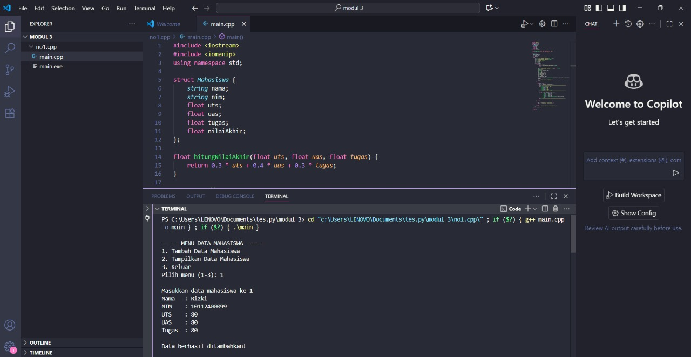
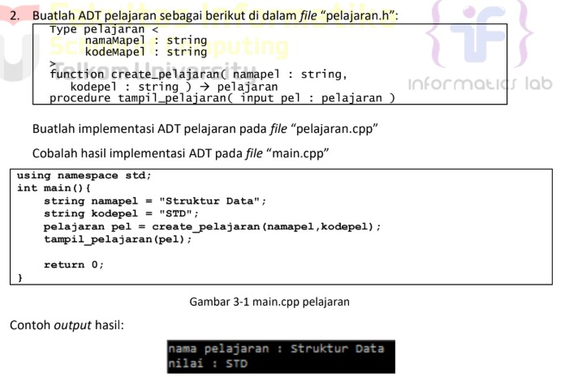
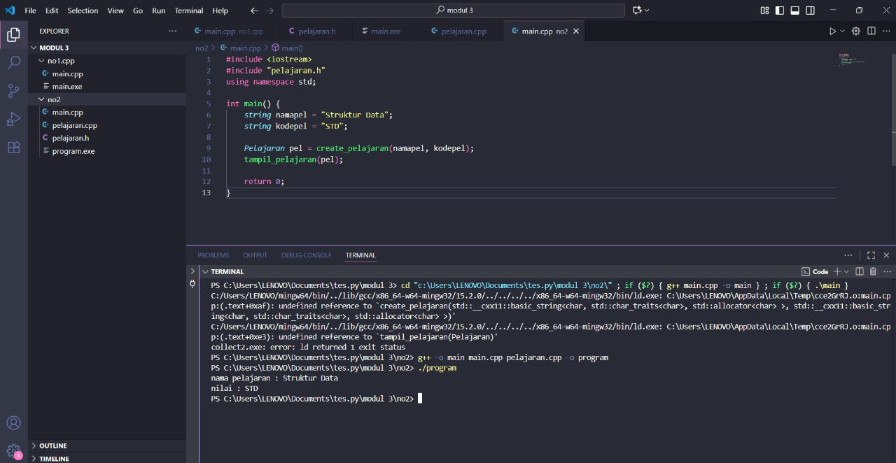

# <h1 align="center">Laporan Praktikum Modul 3 </h1>
<p align="center">Radithia Erlangga - 103112400096</p>

## Dasar Teori

Abstract Data Type (ADT) merupakan konsep penting dalam pemrograman yang mendefinisikan suatu tipe data beserta operasi-operasi dasar yang dapat dilakukan terhadap tipe tersebut tanpa memperhatikan bagaimana implementasinya. ADT berfungsi untuk memisahkan antara definisi logis dari data dengan implementasi fisiknya, sehingga memudahkan pemrograman modular dan pemeliharaan kode. Dalam ADT, setiap tipe data dapat memiliki konstruktor untuk membentuk objek baru, selector untuk mengakses komponen, serta prosedur pengubah nilai dan validasi data. Contoh ADT seperti ADT waktu yang terdiri dari jam dan tanggal, atau garis yang tersusun dari dua titik (POINT). Dengan pendekatan ini, ADT memberikan cara terstruktur untuk merepresentasikan data kompleks menggunakan operasi primitif yang terdefinisi dengan baik.
## Guide

## Menghitung Rata Rata

## mahasiswa.h
```go
#ifndef MAHASISWA_H_INCLUDED
#define MAHASISWA_H_INCLUDED

struct mahasiswa
{
    char nim[10];
    int nilai1, nilai2;
};

void inputMhs(mahasiswa &m);
float rata2(mahasiswa m);

#endif
```

## Mahasiswa.cpp
```go
#include "mahasiswa.h"
#include <iostream>
using namespace std;

void inputMhs(mahasiswa &m)
{
    cout << "input nama = ";
    cin >> (m) .nim;
    cout << "input nilai = ";
    cin >> (m) .nilai1;
    cout << "input niali2 = ";
    cin >> m .nilai2;

}
float rata2(mahasiswa m)
{
    return float(m.nilai1 + m.nilai2) / 2;
}
```

## main.cpp
```go
#include <iostream>
#include "mahasiswa.h"
using namespace std;

int main(){
    mahasiswa mhs;
    inputMhs(mhs);
    cout << "rata rata = " << rata2(mhs);
    return 0;
}
```

## Unguide

### Soal 1

Buat program yang dapat menyimpan data mahasiswa (max. 10) ke dalam sebuah array
dengan field nama, nim, uts, uas, tugas, dan nilai akhir. Nilai akhir diperoleh dari FUNGSI
dengan rumus 0.3*uts+0.4*uas+0.3*tugas.
```go
#include <iostream>
#include <iomanip>
using namespace std;

struct Mahasiswa {
    string nama;
    string nim;
    float uts;
    float uas;
    float tugas;
    float nilaiAkhir;
};

float hitungNilaiAkhir(float uts, float uas, float tugas) {
    return 0.3 * uts + 0.4 * uas + 0.3 * tugas;
}

int main() {
    Mahasiswa mhs[10];
    int jumlah = 0;
    int pilihan;

    do {
        cout << "\n===== MENU DATA MAHASISWA =====" << endl;
        cout << "1. Tambah Data Mahasiswa" << endl;
        cout << "2. Tampilkan Data Mahasiswa" << endl;
        cout << "3. Keluar" << endl;
        cout << "Pilih menu (1-3): ";
        cin >> pilihan;

        switch (pilihan) {
            case 1: {
                if (jumlah >= 10) {
                    cout << "Data sudah penuh (maksimum 10)!" << endl;
                    break;
                }

                cout << "\nMasukkan data mahasiswa ke-" << jumlah + 1 << endl;
                cin.ignore();
                cout << "Nama   : ";
                getline(cin, mhs[jumlah].nama);
                cout << "NIM    : ";
                cin >> mhs[jumlah].nim;
                cout << "UTS    : ";
                cin >> mhs[jumlah].uts;
                cout << "UAS    : ";
                cin >> mhs[jumlah].uas;
                cout << "Tugas  : ";
                cin >> mhs[jumlah].tugas;

                mhs[jumlah].nilaiAkhir = hitungNilaiAkhir(mhs[jumlah].uts, mhs[jumlah].uas, mhs[jumlah].tugas);
                jumlah++;

                cout << "\nData berhasil ditambahkan!\n";
                break;
            }

            case 2: {
                if (jumlah == 0) {
                    cout << "\nBelum ada data mahasiswa.\n";
                } else {
                    cout << "\n============================================================\n";
                    cout << left << setw(15) << "Nama"
                         << setw(10) << "NIM"
                         << setw(10) << "UTS"
                         << setw(10) << "UAS"
                         << setw(10) << "Tugas"
                         << setw(10) << "Akhir" << endl;
                    cout << "============================================================\n";

                    for (int i = 0; i < jumlah; i++) {
                        cout << left << setw(15) << mhs[i].nama
                             << setw(10) << mhs[i].nim
                             << setw(10) << mhs[i].uts
                             << setw(10) << mhs[i].uas
                             << setw(10) << mhs[i].tugas
                             << setw(10) << fixed << setprecision(2) << mhs[i].nilaiAkhir
                             << endl;
                    }
                    cout << "============================================================\n";
                }
                break;
            }

            case 3:
                cout << "\nTerima kasih! Program selesai.\n";
                break;

            default:
                cout << "\nPilihan tidak valid. Silakan coba lagi.\n";
        }

    } while (pilihan != 3);

    return 0;
}

```

> Output
> 

Program ini menampilkan menu utama agar pengguna bisa memilih:
1️. Tambah data mahasiswa (memasukkan nama, NIM, nilai UTS, UAS, dan tugas)
2️. Lihat semua data mahasiswa yang sudah disimpan
3️. Keluar dari program

Setiap kali data dimasukkan, program otomatis menghitung nilai akhir dengan rumus
0.3 * UTS + 0.4 * UAS + 0.3 * Tugas.
Program terus berulang sampai pengguna memilih keluar (3).


### Soal 2
> 

# pelajaran.h
```go
#ifndef PELAJARAN_H_INCLUDED
#define PELAJARAN_H_INCLUDED
#include <string>
using namespace std;

struct Pelajaran {
    string namaMapel;
    string kodeMapel;
};

Pelajaran create_pelajaran(string namapel, string kodepel);
void tampil_pelajaran(Pelajaran pel);

#endif
```

# pelajaran.cpp
```go
#include <iostream>
#include "pelajaran.h"
using namespace std;

Pelajaran create_pelajaran(string namapel, string kodepel) {
    Pelajaran p;
    p.namaMapel = namapel;
    p.kodeMapel = kodepel;
    return p;
}

void tampil_pelajaran(Pelajaran pel) {
    cout << "nama pelajaran : " << pel.namaMapel << endl;
    cout << "nilai : " << pel.kodeMapel << endl;
}
```

# main.cpp
```go
#include <iostream>
#include "pelajaran.h"
using namespace std;

int main() {
    string namapel = "Struktur Data";
    string kodepel = "STD";

    Pelajaran pel = create_pelajaran(namapel, kodepel);
    tampil_pelajaran(pel);

    return 0;
}
```

> Output
> 

Program ini merupakan contoh penerapan Abstract Data Type (ADT) dalam C++. Konsep ADT digunakan untuk memisahkan antara tipe data, fungsi, dan program utama. Pada file pelajaran.h, terdapat tipe data struct Pelajaran dengan atribut namaMapel dan kodeMapel, serta deklarasi fungsi create_pelajaran() dan tampil_pelajaran(). File pelajaran.cpp berisi isi fungsi, yaitu membuat dan menampilkan data pelajaran. Sedangkan file main.cpp digunakan untuk menguji program dengan membuat objek pelajaran dan menampilkannya. Dengan cara ini, program lebih terstruktur, mudah dipahami, dan sesuai dengan konsep dasar ADT.


## Referensi
1. https://www.w3schools.com/cpp/cpp_references.asp
2. https://www.w3schools.com/cpp/cpp_function_reference.asp
3. https://www.w3schools.com/cpp/cpp_function_structures.asp
4. https://www.w3schools.com/cpp/exercise.asp?x=xrcise_function_reference1
5. https://www.w3schools.com/cpp/cpp_function_param.asp
