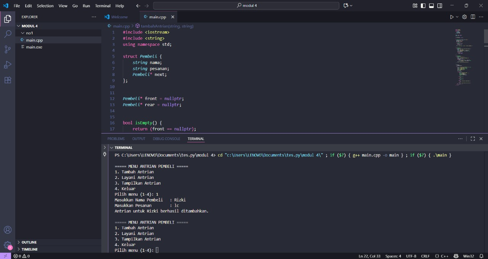
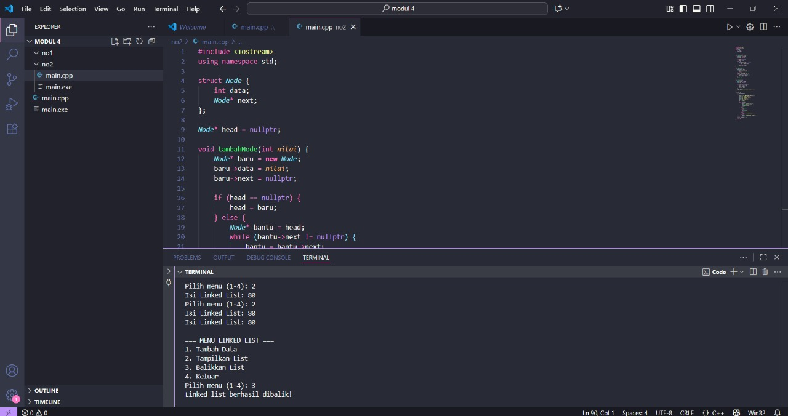

# <h1 align="center">Laporan Praktikum Modul 4 Sinkly linked list </h1>
<p align="center">Radithia Erlangga - 103112400096</p>

## Dasar Teori

Linked List merupakan salah satu bentuk struktur data yang digunakan untuk menyimpan sekumpulan data secara dinamis, di mana setiap elemen saling terhubung melalui pointer. Berbeda dengan array yang bersifat statis dan memiliki ukuran tetap, linked list bersifat fleksibel karena dapat menambah atau menghapus elemen sesuai kebutuhan. Setiap elemen dalam linked list disebut node, yang umumnya terdiri dari dua bagian: data dan pointer yang menunjuk ke node berikutnya. Struktur ini memudahkan pengelolaan data yang sering berubah ukurannya. Dalam implementasinya, pointer digunakan untuk menghubungkan antar node menggunakan operator ->. Linked list cocok digunakan pada kondisi ketika jumlah data tidak diketahui secara pasti dan diperlukan efisiensi dalam proses penyisipan atau penghapusan elemen.
## Guide

## Likedlist.cpp
```go
#include <iostream>
using namespace std;

// Struktur Node
struct Node {
    int data;
    Node* next;
};

// Pointer awal dan akhir
Node* head = nullptr;

// Fungsi untuk membuat node baru
Node* createNode(int data) {
    Node* newNode = new Node();
    newNode->data = data;
    newNode->next = nullptr;
    return newNode;
}


void insertBelakang(int data) {
    Node* newNode = createNode(data);
    if (head == nullptr) {
        head = newNode;
    } else {
        Node* temp = head;
        while (temp->next != nullptr) {
            temp = temp->next;
        }
        temp->next = newNode;
    }
    cout << "Data " << data << " berhasil ditambahkan di belakang.\n";
}

void insertSetelah(int target, int dataBaru) {
    Node* temp = head;
    while (temp != nullptr && temp->data != target) {
        temp = temp->next;
    }

    if (temp == nullptr) {
        cout << "Data " << target << " tidak ditemukan!\n";
    } else {
        Node* newNode = createNode(dataBaru);
        newNode->next = temp->next;
        temp->next = newNode;
        cout << "Data " << dataBaru << " berhasil disisipkan setelah " << target << ".\n";
    }
}

// ========== DELETE FUNCTION ==========
void hapusNode(int data) {
    if (head == nullptr) {
        cout << "List kosong!\n";
        return;
    }

    Node* temp = head;
    Node* prev = nullptr;

    // Jika data di node pertama
    if (temp != nullptr && temp->data == data) {
        head = temp->next;
        delete temp;
        cout << "Data " << data << " berhasil dihapus.\n";
        return;
    }

    // Cari node yang akan dihapus
    while (temp != nullptr && temp->data != data) {
        prev = temp;
        temp = temp->next;
    }

    // Jika data tidak ditemukan
    if (temp == nullptr) {
        cout << "Data " << data << " tidak ditemukan!\n";
        return;
    }

    prev->next = temp->next;
    delete temp;
    cout << "Data " << data << " berhasil dihapus.\n";
}

// ========== UPDATE FUNCTION ==========
void updateNode(int dataLama, int dataBaru) {
    Node* temp = head;
    while (temp != nullptr && temp->data != dataLama) {
        temp = temp->next;
    }

    if (temp == nullptr) {
        cout << "Data " << dataLama << " tidak ditemukan!\n";
    } else {
        temp->data = dataBaru;
        cout << "Data " << dataLama << " berhasil diupdate menjadi " << dataBaru << ".\n";
    }
}

// ========== DISPLAY FUNCTION ==========
void tampilkanList() {
    if (head == nullptr) {
        cout << "List kosong!\n";
        return;
    }

    Node* temp = head;
    cout << "Isi Linked List: ";
    while (temp != nullptr) {
        cout << temp->data << " -> ";
        temp = temp->next
    }
    cout << "NULL\n";
}

// ========== MAIN PROGRAM ==========
int main() {
    int pilihan, data, target, dataBaru;

    do {
        cout << "\n=== MENU SINGLE LINKED LIST ===\n";
        cout << "1. Insert Depan\n";
        cout << "2. Insert Belakang\n";
        cout << "3. Insert Setelah\n";
        cout << "4. Hapus Data\n";
        cout << "5. Update Data\n";
        cout << "6. Tampilkan List\n";
        cout << "0. Keluar\n";
        cout << "Pilih: ";
        cin >> pilihan;

        switch (pilihan) {
            case 1:
                cout << "Masukkan data: ";
                cin >> data;
                insertDepan(data);
                break;
            case 2:
                cout << "Masukkan data: ";
                cin >> data;
                insertBelakang(data);
                break;
            case 3:
                cout << "Masukkan data target: ";
                cin >> target;
                cout << "Masukkan data baru: ";
                cin >> dataBaru;
                insertSetelah(target, dataBaru);
                break;
            case 4:
                cout << "Masukkan data yang ingin dihapus: ";
                cin >> data;
                hapusNode(data);
                break;
            case 5:
                cout << "Masukkan data lama: ";
                cin >> data;
                cout << "Masukkan data baru: ";
                cin >> dataBaru;
                updateNode(data, dataBaru);
                break;
            case 6:
                tampilkanList();
                break;
            case 0:
                cout << "Program selesai.\n";
                break;
            default:
                cout << "Pilihan tidak valid!\n";
        }
    } while (pilihan != 0);

    return 0;
}

```

## Unguide

### Soal 1

Buatlah single linked list untuk Antrian yang menyimpan data pembeli( nama dan pesanan). program memiliki beberapa menu seperti tambah antrian, layani antrian(hapus), dan tampilkan antrian. *antrian pertama harus yang pertama dilayani menggunakan c++
```go
#include <iostream>
#include <string>
using namespace std;

struct Pembeli {
    string nama;
    string pesanan;
    Pembeli* next; 
};


Pembeli* front = nullptr;
Pembeli* rear = nullptr;


bool isEmpty() {
    return (front == nullptr);
}


void tambahAntrian(string nama, string pesanan) {
    Pembeli* baru = new Pembeli;
    baru->nama = nama;
    baru->pesanan = pesanan;
    baru->next = nullptr;

    if (isEmpty()) {
        front = rear = baru;
    } else {
        rear->next = baru;
        rear = baru;
    }
    cout << "Antrian untuk " << nama << " berhasil ditambahkan.\n";
}


void layaniAntrian() {
    if (isEmpty()) {
        cout << "Antrian kosong, tidak ada yang dilayani.\n";
    } else {
        Pembeli* hapus = front;
        cout << "Melayani pembeli: " << hapus->nama
             << " | Pesanan: " << hapus->pesanan << endl;
        front = front->next;
        delete hapus;

        if (front == nullptr)
            rear = nullptr; 
    }
}


void tampilAntrian() {
    if (isEmpty()) {
        cout << "Antrian kosong.\n";
    } else {
        cout << "\n=== DAFTAR ANTRIAN PEMBELI ===\n";
        Pembeli* bantu = front;
        int nomor = 1;
        while (bantu != nullptr) {
            cout << nomor++ << ". Nama: " << bantu->nama
                 << " | Pesanan: " << bantu->pesanan << endl;
            bantu = bantu->next;
        }
        cout << "===============================\n";
    }
}


int main() {
    int pilihan;
    string nama, pesanan;

    do {
        cout << "\n===== MENU ANTRIAN PEMBELI =====" << endl;
        cout << "1. Tambah Antrian" << endl;
        cout << "2. Layani Antrian" << endl;
        cout << "3. Tampilkan Antrian" << endl;
        cout << "4. Keluar" << endl;
        cout << "Pilih menu (1-4): ";
        cin >> pilihan;
        cin.ignore(); 

        switch (pilihan) {
            case 1:
                cout << "Masukkan Nama Pembeli   : ";
                getline(cin, nama);
                cout << "Masukkan Pesanan        : ";
                getline(cin, pesanan);
                tambahAntrian(nama, pesanan);
                break;

            case 2:
                layaniAntrian();
                break;

            case 3:
                tampilAntrian();
                break;

            case 4:
                cout << "Terima kasih, program selesai.\n";
                break;

            default:
                cout << "Pilihan tidak valid, coba lagi.\n";
        }
    } while (pilihan != 4);

    return 0;
}

```

> Output
> 

-Program ini menggunakan linked list untuk membuat sistem antrian pembeli.
-Struct Pembeli berisi data nama, pesanan, dan pointer next.
-Fungsi tambahAntrian() menambah data di belakang (enqueue).
-Fungsi layaniAntrian() menghapus data di depan (dequeue).
-Fungsi tampilAntrian() menampilkan semua pembeli dalam antrian.
-Program berjalan terus sampai pengguna memilih menu Keluar, dan mengikuti konsep FIFO (First In First Out) — pembeli pertama dilayani pertama kali.


### Soal 2
buatlah program kode untuk membalik (reverse) singly linked list (1-2-3 menjadi 3-2-1)

# 
```go
#include <iostream>
using namespace std;

struct Node {
    int data;
    Node* next;
};

Node* head = nullptr;

void tambahNode(int nilai) {
    Node* baru = new Node;
    baru->data = nilai;
    baru->next = nullptr;

    if (head == nullptr) {
        head = baru;
    } else {
        Node* bantu = head;
        while (bantu->next != nullptr) {
            bantu = bantu->next;
        }
        bantu->next = baru;
    }
}

void tampilList() {
    Node* bantu = head;
    if (bantu == nullptr) {
        cout << "List kosong.\n";
        return;
    }
    cout << "Isi Linked List: ";
    while (bantu != nullptr) {
        cout << bantu->data << " ";
        bantu = bantu->next;
    }
    cout << endl;
}

void balikList() {
    Node* prev = nullptr;
    Node* current = head;
    Node* next = nullptr;

    while (current != nullptr) {
        next = current->next;   
        current->next = prev; 
        prev = current;         
        current = next;         
    }
    head = prev; 
    cout << "Linked list berhasil dibalik!\n";
}

int main() {
    int pilihan, nilai;

    do {
        cout << "\n=== MENU LINKED LIST ===\n";
        cout << "1. Tambah Data\n";
        cout << "2. Tampilkan List\n";
        cout << "3. Balikkan List\n";
        cout << "4. Keluar\n";
        cout << "Pilih menu (1-4): ";
        cin >> pilihan;

        switch (pilihan) {
            case 1:
                cout << "Masukkan nilai: ";
                cin >> nilai;
                tambahNode(nilai);
                break;
            case 2:
                tampilList();
                break;
            case 3:
                balikList();
                break;
            case 4:
                cout << "Program selesai.\n";
                break;
            default:
                cout << "Pilihan tidak valid!\n";
        }
    } while (pilihan != 4);

    return 0;
}

```

> Output
> 

-Program ini membuat singly linked list yang dapat dibalik urutannya:
-Fungsi tambahNode() menambah data di akhir list.
-Fungsi balikList() menggunakan tiga pointer:
-prev untuk menyimpan node sebelumnya,
-current untuk node saat ini,
-next untuk menyimpan node berikutnya.
-Setiap iterasi mengubah arah next agar menunjuk ke node sebelumnya.
-Setelah selesai, head diarahkan ke node terakhir (yang jadi paling depan).


## Referensi
1.https://www.w3schools.com/dsa/dsa_theory_linkedlists.php
2.https://www.w3schools.com/dsa/dsa_algo_linkedlists_operations.php
3.https://www.w3schools.com/dsa/dsa_data_linkedlists_types.php
4.https://www.w3schools.com/dsa/dsa_theory_linkedlists_memory.php
5.https://www.w3schools.com/dsa/dsa_data_queues.php

