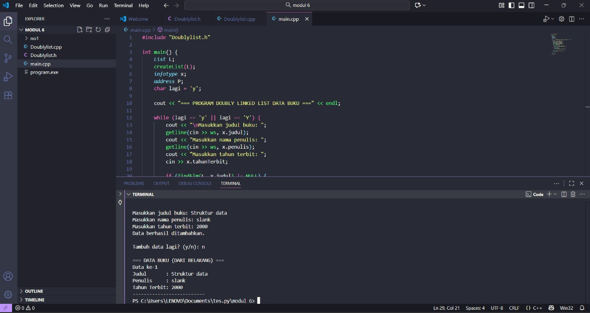

# <h1 align="center">Laporan Praktikum Modul 6 Doubly linked list </h1>
<p align="center">Radithia Erlangga - 103112400096</p>

## Dasar Teori

Doubly linked list adalah struktur data yang terdiri dari rangkaian node, di mana setiap node memiliki tiga bagian utama: data, pointer ke node sebelumnya (prev), dan pointer ke node berikutnya (next). Berbeda dengan singly linked list yang hanya bisa ditelusuri satu arah, doubly linked list memungkinkan penelusuran data baik dari depan ke belakang maupun sebaliknya, sehingga mempermudah operasi seperti penyisipan dan penghapusan data di kedua ujung atau di tengah-tengah list. Namun, penggunaan dua pointer membuat struktur ini membutuhkan lebih banyak memori dibanding singly linked list.

## Guide
```go
#include <iostream>
using namespace std;

struct Node {
    int data;
    Node* prev;
    Node* next;
};

Node* head = nullptr;
Node* tail = nullptr;

void insertDepan(int data) {
    Node* newNode = new Node();
    newNode->data = data;
    newNode->prev = nullptr;
    newNode->next = head;

    if (head != nullptr)
       head->prev = newNode;
    else
       tail = newNode;

    head = newNode;
    cout << "Data " << data << " berhasil ditambahkan di depan. \n";
}

void insertBelakang(int data) {
    Node* newNode = new Node();
    newNode->data = data;
    newNode->next = nullptr;
    newNode->prev = tail;

    if (tail != nullptr)
        tail->next = newNode;
    else
        head = newNode;

    tail = newNode;
    cout << "Data " << data << " berhasil ditambahkan di belakang.\n";
}

void insertSetelah(int target, int data) {
    Node* current = head;
    while (current != nullptr && current ->data != target)
        current = current->next;

    if(current == nullptr) {
        cout << "Data " << target << " tidak ditemukan.\n";
        return;
    }

    Node* newNode = new Node();
    newNode->data = data;
    newNode->next = current->next;
    newNode->prev = current;

    if (current->next != nullptr)
        current->next->prev = newNode;
    else
        tail = newNode;

    current->next = newNode;
    cout << "Data " << data << " berhasil disisipkan setelah " << target << ".\n";
}

void hapusDepan() {
    if (head == nullptr) {
        cout << "List kosong.\n";
        return;
    }

    Node* temp = head;
    head = head->next;

    if (head != nullptr)
        head->prev = nullptr;
    else
        tail = nullptr;

    cout << "Data " << temp->data << " dihapus dari depan.\n";
    delete temp;
}

void hapusBelakang() {
    if  (tail == nullptr) {
        cout << "List kosong.\n";
        return;
    }

    Node* temp = tail;
    tail = tail->prev;

    if (tail != nullptr)
        tail->next = nullptr;
    else
        head = nullptr;
    
    cout << "Data " << temp->data << " dihapus dari belakang.\n";
    delete temp;
}

void hapusData(int target) {
    Node* current = head;
    while (current != nullptr && current->data != target)
        current = current->next;

    if (current == nullptr) {
        cout << "Data " << target << " tidak ditemukan.\n";
        return;
    }

    if (current == head)
        hapusDepan();
    else if (current == tail)
        hapusBelakang();
    else {
        current->prev->next = current->next;
        current->next->prev = current->prev;
        cout << "Data " << target << " dihapus.\n";
        delete current;
    }
}
void updateData(int oldData, int newData) {
    Node* current = head;
    while (current != nullptr && current->data != oldData)
        current = current->next;

    if (current == nullptr) {
        cout << "Data " << oldData << " tidak ditemukan.\n";
        return;
    }

    current->data = newData;
    cout << "Data " << oldData << " diubah menjadi " << newData << ".\n";
}
void tampilDepan() {
    if (head == nullptr) {
        cout << "List kosong.\n";
        return;
    }

    cout << "Isi list (dari depan): ";
    Node* current = head;
    while (current != nullptr) {
        cout << current->data << " ";
        current = current->next;
    }
    cout << "\n";
}

// ====================================
// Fungsi: Tampilkan dari belakang
// ====================================
void tampilBelakang() {
    if (tail == nullptr) {
        cout << "List kosong.\n";
        return;
    }

    cout << "Isi list (dari belakang): ";
    Node* current = tail;
    while (current != nullptr) {
        cout << current->data << " ";
        current = current->prev;
    }
    cout << "\n";
}

// ====================================
// MAIN PROGRAM (MENU INTERAKTIF)
// ====================================
int main() {
    int pilihan, data, target, oldData, newData;

    do {
        cout << "\n===== MENU DOUBLE LINKED LIST =====\n";
        cout << "1. Insert Depan\n";
        cout << "2. Insert Belakang\n";
        cout << "3. Insert Setelah Data\n";
        cout << "4. Hapus Depan\n";
        cout << "5. Hapus Belakang\n";
        cout << "6. Hapus Data Tertentu\n";
        cout << "7. Update Data\n";
        cout << "8. Tampil dari Depan\n";
        cout << "9. Tampil dari Belakang\n";
        cout << "0. Keluar\n";
        cout << "===================================\n";
        cout << "Pilih menu: ";
        cin >> pilihan;

        switch (pilihan) {
            case 1:
                cout << "Masukkan data: ";
                cin >> data;
                insertDepan(data);
                break;
            case 2:
                cout << "Masukkan data: ";
                cin >> data;
                insertBelakang(data);
                break;
            case 3:
                cout << "Masukkan data target: ";
                cin >> target;
                cout << "Masukkan data baru: ";
                cin >> data;
                insertSetelah(target, data);
                break;
            case 4:
                hapusDepan();
                break;
            case 5:
                hapusBelakang();
                break;
            case 6:
                cout << "Masukkan data yang ingin dihapus: ";
                cin >> target;
                hapusData(target);
                break;
            case 7:
                cout << "Masukkan data lama: ";
                cin >> oldData;
                cout << "Masukkan data baru: ";
                cin >> newData;
                updateData(oldData, newData);
                break;
            case 8:
                tampilDepan();
                break;
            case 9:
                tampilBelakang();
                break;
            case 0:
                cout << "👋 Keluar dari program.\n";
                break;
            default:
                cout << "Pilihan tidak valid.\n";
        }

    } while (pilihan != 0);

    return 0;
}

```

## Unguide

### Soal 1
Buatlah ADT Doubly Linked list sebagai berikut di dalam file “Doublylist.h”:

## Doublylist.h
```go
#ifndef DOUBLYLIST_H
#define DOUBLYLIST_H

#include <iostream>
#include <string>
using namespace std;

struct buku {
    string judul;
    string penulis;
    int tahunTerbit;
};

typedef buku infotype;
typedef struct ElmList *address;

struct ElmList {
    infotype info;
    address next;
    address prev;
};

struct List {
    address first;
    address last;
};

void createList(List &L);
address alokasi(infotype x);
void dealokasi(address &P);
void insertLast(List &L, address P);
void printInfo(List L);
address findElm(List L, string judul);

#endif

```

## Doublylist.cpp
```go
#include "Doublylist.h"

void createList(List &L) {
    L.first = NULL;
    L.last = NULL;
}

address alokasi(infotype x) {
    address P = new ElmList;
    P->info = x;
    P->next = NULL;
    P->prev = NULL;
    return P;
}

void dealokasi(address &P) {
    delete P;
    P = NULL;
}

void insertLast(List &L, address P) {
    if (L.first == NULL) {
        L.first = P;
        L.last = P;
    } else {
        L.last->next = P;
        P->prev = L.last;
        L.last = P;
    }
}

void printInfo(List L) {
    address P = L.last;
    int i = 1;

    if (P == NULL) {
        cout << "\nList kosong.\n";
        return;
    }

    cout << "\n=== DATA BUKU (DARI BELAKANG) ===\n";
    while (P != NULL) {
        cout << "Data ke-" << i << endl;
        cout << "Judul       : " << P->info.judul << endl;
        cout << "Penulis     : " << P->info.penulis << endl;
        cout << "Tahun Terbit: " << P->info.tahunTerbit << endl;
        cout << "--------------------------\n";
        P = P->prev;
        i++;
    }
}

address findElm(List L, string judul) {
    address P = L.first;
    while (P != NULL) {
        if (P->info.judul == judul) {
            return P;
        }
        P = P->next;
    }
    return NULL;
}

```

## main.cpp
```go
#include "Doublylist.h"

int main() {
    List L;
    createList(L);
    infotype x;
    address P;
    char lagi = 'y';

    cout << "=== PROGRAM DOUBLY LINKED LIST DATA BUKU ===" << endl;

    while (lagi == 'y' || lagi == 'Y') {
        cout << "\nMasukkan judul buku: ";
        getline(cin >> ws, x.judul);
        cout << "Masukkan nama penulis: ";
        getline(cin >> ws, x.penulis);
        cout << "Masukkan tahun terbit: ";
        cin >> x.tahunTerbit;

        if (findElm(L, x.judul) != NULL) {
            cout << "Judul buku sudah terdaftar!\n";
        } else {
            P = alokasi(x);
            insertLast(L, P);
            cout << "Data berhasil ditambahkan.\n";
        }

        cout << "\nTambah data lagi? (y/n): ";
        cin >> lagi;
    }

    printInfo(L);

    return 0;
}

```

> Output
> 
Program Doubly Linked List data buku ini digunakan untuk menyimpan dan menampilkan informasi buku yang terdiri dari judul, penulis, dan tahun terbit. Setiap data buku disimpan dalam node yang saling terhubung dua arah, yaitu ke node sebelumnya (prev) dan node berikutnya (next), sehingga data dapat ditelusuri dari depan maupun belakang. Program ini memungkinkan pengguna menambahkan data buku baru ke akhir list dan mengecek apakah judul buku sudah ada agar tidak duplikat. Setelah input selesai, seluruh data buku akan ditampilkan dari belakang ke depan menggunakan fungsi printInfo().


## Referensi
1.https://www.w3schools.com/dsa/dsa_theory_linkedlists.php
2.https://www.w3schools.com/dsa/dsa_data_linkedlists_types.php
3.https://www.w3schools.com/dsa/dsa_algo_linkedlists_operations.php
4.https://www.w3schools.com/dsa/dsa_theory_linkedlists_memory.php
5.https://www.w3schools.com/dsa/dsa_examples.php

