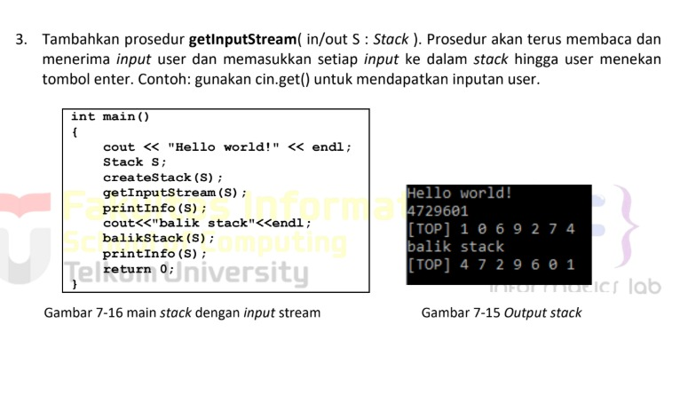

# <h1 align="center">Laporan Praktikum Modul 7 Stack</h1>
<p align="center">Radithia Erlangga - 103112400096</p>

## Dasar Teori
Stack adalah salah satu struktur data yang menggunakan prinsip LIFO (Last In, First Out), yaitu elemen yang terakhir dimasukkan akan menjadi elemen pertama yang dikeluarkan. Struktur ini dapat diibaratkan seperti tumpukan piring, di mana piring yang terakhir diletakkan di atas akan diambil terlebih dahulu. Operasi utama pada stack meliputi push (menambahkan elemen ke puncak stack), pop (menghapus elemen dari puncak stack), dan peek/top (melihat elemen teratas tanpa menghapusnya). Stack banyak digunakan dalam pemrograman, seperti untuk menyimpan data sementara dalam pemanggilan fungsi (call stack), membalik urutan data, dan dalam proses evaluasi ekspresi matematika atau algoritma backtracking.

## Guide
```
#include <iostream>
using namespace std;

struct Node
{
    int data;
    Node *next;
};

bool isEmpety(Node *top)
{
    return top == nullptr;
}

void push(Node *&top, int data){
    Node *newNode = new Node;
    newNode -> data = data;
    newNode -> next = top;
    top = newNode;
}

int pop(Node *&top)
{
    if (isEmpety(top))
    {
        cout << "Stack Kosong, tidak bisa pop!" << endl;
        return 0;
    }

    int poppedData = top -> data;
    top = top -> next;

    Node *temp;
    return poppedData;
}

void show (Node *top)
{
    if (isEmpety(top))
    {
        cout << "Stack kosong," << endl;
        return;
    }
    cout << "TOP -> ";
    Node *temp = top;

    while (temp != nullptr)
    {
        cout << temp->data << "-> ";
        temp = temp->next;
    }

    cout << "NULL" << endl;

}

int main()
{
    Node *stack = nullptr;

    push(stack, 10);
    push(stack, 20);
    push(stack, 30);

    cout << "Menampilkan isi stack:" << endl;
    show (stack);

    cout << "pop;" << pop(stack) << endl;

    cout << "Menampilkan sisa Stack:" << endl;
    show(stack);

    return 0;
}

```

## Unguide

### Soal 1
> 
## stack.h
```go
#ifndef STACK_H
#define STACK_H

const int MAX = 20;

typedef int infotype;

struct Stack {
    infotype info[MAX];
    int top;
};

void createStack(Stack &S);
void push(Stack &S, infotype x);
infotype pop(Stack &S);
void printInfo(Stack S);
void balikStack(Stack &S);

#endif
```
## stack.cpp
```go
#include <iostream>
#include "stack.h"
using namespace std;

void createStack(Stack &S) {
    S.top = -1;
}

void push(Stack &S, infotype x) {
    if (S.top < MAX - 1) {
        S.top++;
        S.info[S.top] = x;
    } else {
        cout << "Stack penuh!" << endl;
    }
}

infotype pop(Stack &S) {
    if (S.top >= 0) {
        infotype x = S.info[S.top];
        S.top--;
        return x;
    } else {
        cout << "Stack kosong!" << endl;
        return -1;
    }
}

void printInfo(Stack S) {
    cout << "[TOP] ";
    for (int i = S.top; i >= 0; i--) {
        cout << S.info[i] << " ";
    }
    cout << endl;
}

void balikStack(Stack &S) {
    Stack temp;
    createStack(temp);
    while (S.top >= 0) {
        push(temp, pop(S));
    }
    S = temp;
}
```
## main.cpp
```go
#include <iostream>
#include "stack.h"
using namespace std;

int main() {
    cout << "Hello world!" << endl;

    Stack S;
    createStack(S);

    push(S, 3);
    push(S, 4);
    push(S, 2);
    push(S, 9);
    pop(S);
    push(S, 2);
    push(S, 3);
    pop(S);
    push(S, 9);

    printInfo(S);

    cout << "balik stack" << endl;
    balikStack(S);

    printInfo(S);

    return 0;
}

```

> Output
> 
Program ini membuat struktur data stack yang bekerja dengan sistem LIFO (Last In First Out). Artinya, data yang terakhir dimasukkan akan keluar lebih dulu. Program bisa menambah data dengan push, menghapus data dengan pop, menampilkan isi stack dengan printInfo, dan membalik isi stack dengan balikStack. Di main, program mencoba beberapa operasi tersebut lalu menampilkan hasil sebelum dan sesudah stack dibalik.

### Soal 2
> 

## stack.h
```go
#ifndef STACK_H
#define STACK_H

const int MAX = 20;
typedef int infotype;

struct Stack {
    infotype info[MAX];
    int top;
};

void createStack(Stack &S);
bool isFull(Stack S);
bool isEmpty(Stack S);
void push(Stack &S, infotype x);
infotype pop(Stack &S);
void printInfo(Stack S);
void balikStack(Stack &S);
void pushAscending(Stack &S, infotype x);

#endif
```

## stack.cpp
```go
#include <iostream>
#include "stack.h"
using namespace std;

void createStack(Stack &S) {
    S.top = -1;
}

bool isFull(Stack S) {
    return S.top == MAX - 1;
}

bool isEmpty(Stack S) {
    return S.top == -1;
}

void push(Stack &S, infotype x) {
    if (!isFull(S)) {
        S.top++;
        S.info[S.top] = x;
    } else {
        cout << "Stack penuh!" << endl;
    }
}

infotype pop(Stack &S) {
    if (!isEmpty(S)) {
        infotype x = S.info[S.top];
        S.top--;
        return x;
    } else {
        cout << "Stack kosong!" << endl;
        return -1;
    }
}

void printInfo(Stack S) {
    cout << "[TOP] ";
    for (int i = S.top; i >= 0; i--) {
        cout << S.info[i] << " ";
    }
    cout << endl;
}

void balikStack(Stack &S) {
    Stack temp;
    createStack(temp);
    while (!isEmpty(S)) {
        push(temp, pop(S));
    }
    S = temp;
}

void pushAscending(Stack &S, infotype x) {
    Stack temp;
    createStack(temp);

    while (!isEmpty(S) && S.info[S.top] < x) {
        push(temp, pop(S));
    }

    push(S, x);

    while (!isEmpty(temp)) {
        push(S, pop(temp));
    }
}

```

## main.cpp
```go
#include <iostream>
#include "stack.h"
using namespace std;

int main() {
    cout << "Hello world!" << endl;
    Stack S;
    createStack(S);

    pushAscending(S, 3);
    pushAscending(S, 4);
    pushAscending(S, 8);
    pushAscending(S, 2);
    pushAscending(S, 3);
    pushAscending(S, 9);

    printInfo(S);

    cout << "balik stack" << endl;
    balikStack(S);
    printInfo(S);

    return 0;
}
```

> Output
> 
Program ini memakai struktur stack (tumpukan) untuk menyimpan data secara berurutan naik.
Prosedur pushAscending memastikan setiap kali data baru dimasukkan, posisi elemen tetap tersusun naik — jadi nilai yang paling besar berada di atas (TOP).
Prosedur balikStack hanya membalik isi stack supaya urutannya jadi dari kecil ke besar.

### Soal 3
> 
## stack.h
```go
#ifndef STACK_H
#define STACK_H

const int MAX = 20;
typedef int infotype;

struct Stack {
    infotype info[MAX];
    int top;
};

void createStack(Stack &S);
bool isFull(Stack S);
bool isEmpty(Stack S);
void push(Stack &S, infotype x);
infotype pop(Stack &S);
void printInfo(Stack S);
void balikStack(Stack &S);
void getInputStream(Stack &S);

#endif
```

## stack.cpp
```go
#include <iostream>
#include "stack.h"
using namespace std;

void createStack(Stack &S) {
    S.top = -1;
}

bool isFull(Stack S) {
    return S.top == MAX - 1;
}

bool isEmpty(Stack S) {
    return S.top == -1;
}

void push(Stack &S, infotype x) {
    if (!isFull(S)) {
        S.top++;
        S.info[S.top] = x;
    } else {
        cout << "Stack penuh!" << endl;
    }
}

infotype pop(Stack &S) {
    if (!isEmpty(S)) {
        infotype x = S.info[S.top];
        S.top--;
        return x;
    } else {
        cout << "Stack kosong!" << endl;
        return -1;
    }
}

void printInfo(Stack S) {
    cout << "[TOP] ";
    for (int i = S.top; i >= 0; i--) {
        cout << S.info[i] << " ";
    }
    cout << endl;
}

void balikStack(Stack &S) {
    Stack temp;
    createStack(temp);
    while (!isEmpty(S)) {
        push(temp, pop(S));
    }
    S = temp;
}

// === Prosedur getInputStream ===
void getInputStream(Stack &S) {
    char c;
    cout << "Masukkan angka (tekan ENTER untuk selesai): ";
    while (true) {
        c = cin.get(); // baca satu karakter
        if (c == '\n') break; // berhenti saat tekan enter
        if (isdigit(c)) { // hanya simpan angka
            push(S, c - '0'); // ubah char ke int
        }
    }
}
```

## main.cpp
```go
#include <iostream>
#include "stack.h"
using namespace std;

int main() {
    cout << "Hello world!" << endl;
    Stack S;
    createStack(S);

    getInputStream(S);
    printInfo(S);

    cout << "balik stack" << endl;
    balikStack(S);
    printInfo(S);

    return 0;
}
```

> Output
> 
Program ini membuat stack dan membaca input angka dari user satu per satu.
Saat pengguna mengetik angka (misalnya 4729601) dan menekan ENTER, program langsung menyimpan tiap angka ke dalam stack dari atas ke bawah.
Lalu saat dicetak, urutannya terbalik karena stack bersifat LIFO (Last In First Out).
Prosedur balikStack digunakan agar hasilnya bisa ditampilkan dari urutan semula.


## Referensi
1. https://www.w3schools.com/cpp/cpp_references.asp
2. https://www.w3schools.com/cpp/cpp_function_reference.asp
3. https://www.w3schools.com/cpp/cpp_function_structures.asp
4. https://www.w3schools.com/cpp/exercise.asp?x=xrcise_function_reference1
5. https://www.w3schools.com/cpp/cpp_function_param.asp

